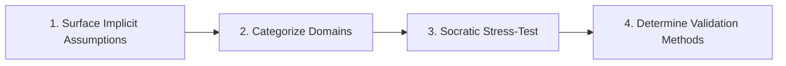

# Assumption Review

Identify, interrogate, and challenge implicit assumptions before committing to architecture, requirements, or code changes.

## Challenge Workflow

1. **Surface Assumptions**: Identify unstated premises regarding user behavior, data volumes, network reliability, third-party API availability, and performance.
2. **Categorize Domains**: Classify into Technical, Operational, Domain/Business, or User Experience assumptions.
3. **Socratic Stress-Test**: Ask "What if this assumption is wrong?" and "What is the cost of being wrong?".
4. **Determine Validation**: Convert high-risk assumptions into automated benchmarks, spikes, or contract tests.

---

## Assumption Catalogs & Interview Guides
* For the taxonomy of hidden assumptions and interview prompts, see **[REFERENCE.md](REFERENCE.md)**.