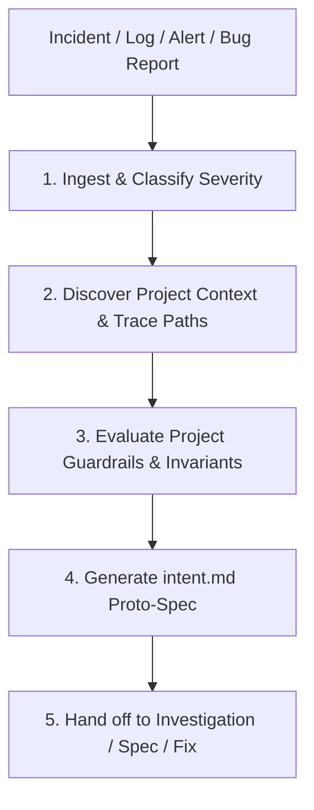

# Auto-Triage Incident

Transform runtime telemetry, bug reports, and metric anomalies into structured, machine-actionable `intent.md` proto-specs to close the loop in the AI-native SDLC across any codebase.

## Triage Workflow

### 1. Ingest & Classify Severity
- Parse the input payload (error logs, stack traces, metric breaches, or bug reports).
- Classify the incident into a standardized severity tier (see [REFERENCE.md](REFERENCE.md)):
  - **P0 - Critical**: Data loss, security breach, financial/transaction corruption, total service outage.
  - **P1 - Major**: Core customer workflow degraded, performance/SLA breach, high-frequency error rate.
  - **P2 - Minor**: Edge-case failure, cosmetic/UI discrepancy, non-blocking administrative issue.

### 2. Discover Project Context & Trace Code Paths
- Dynamically identify the project architecture (monorepo packages, services, or microservices) by inspecting workspace configuration (`Cargo.toml`, `package.json`, `go.mod`, `pyproject.toml`, etc.).
- Trace stack traces and error sites to specific modules, source files, and recent git commits.

### 3. Evaluate Project Guardrails & Invariants
- Read the active workspace's rules and architecture files (`AGENTS.md`, `CLAUDE.md`, `docs/ARCHITECTURE.md`, or `.agents/rules/`).
- Check if the incident violates critical project invariants (e.g., concurrency models, type safety constraints, performance budgets, transaction boundaries).

### 4. Generate the `intent.md` Proto-Spec
- Create the target intent artifact (e.g., `docs/intent/intent-<id_or_slug>.md` or `intent/<id_or_slug>.md`).
- Populate using the universal `intent.md` schema (see [REFERENCE.md](REFERENCE.md)):
  - `# Intent: <Short Incident Title>`
  - `## Incident Metadata` (ID, timestamp, severity, affected components)
  - `## Problem & Symptoms` (Observed behavior, user/system impact)
  - `## Evidence & Trace Data` (Sanitized logs, stack traces, reproduction payloads)
  - `## Root Cause Hypothesis` (Suspected failure mechanism & code paths)
  - `## Proposed Outcome & Invariants` (Target behavior, architectural boundaries)
  - `## Reproduction & Verification Plan` (Target test harness to reproduce before fixing)
  - `## Open Questions & Policy Checks`

### 5. Handoff to Downstream SDLC Stages
- **For immediate diagnosis**: Trigger investigation workflows to reproduce root cause with a failing test.
- **For implementation**: Feed `intent.md` into spec generation or branch setup to restart the AI-native SDLC loop.
