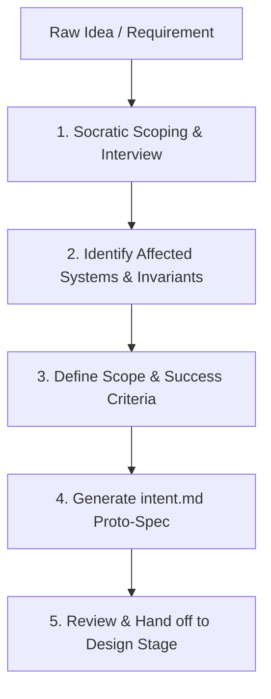

# Draft Intent (Proto-Spec)

Collaborate with originators to transform raw ideas, pain points, or high-level feature requests into structured, machine-actionable `intent.md` proto-specs.

## Intent Drafting Workflow

### 1. Socratic Scoping & Interview
- Elicit the core motivation from the originator without requiring formal specifications.
- Ask targeted clarifying questions:
  - **Problem Statement**: What problem exists today, and who experiences it?
  - **Desired Outcome**: What does success look like once this is shipped?
  - **Non-Goals**: What is explicitly out of scope for this iteration?

### 2. Identify Affected Systems & Invariants
- Inspect the active workspace to understand affected components (e.g., APIs, database models, frontend views, workers).
- Read project rules (`AGENTS.md`, `CLAUDE.md`, or `docs/ARCHITECTURE.md`) to capture non-negotiable invariants (performance, security, data integrity).

### 3. Define Scope & Success Criteria
- Establish quantifiable, testable criteria for acceptance.
- Capture open questions or policy ambiguities that must be resolved during Stage 2 (Design).

### 4. Generate the `intent.md` Proto-Spec
- Create the target file (e.g. `docs/intent/intent-<feature-slug>.md` or `intent/<feature-slug>.md`).
- Format using the universal template (see [REFERENCE.md](REFERENCE.md)):
  - `# Intent: <Title>`
  - `## Metadata` (Author, Date, Status: Draft/Approved, Target Milestone)
  - `## Problem & Context` (The "Why")
  - `## Proposed Outcome` (The "What")
  - `## Affected Systems & Stakeholders`
  - `## Constraints & Invariants` (Performance, security, backwards compatibility)
  - `## Success Metrics & Acceptance Signals`
  - `## Open Questions & Flagged Concerns`

### 5. Review & Terse Handoff to Design (Stage 2)
- Present the generated draft to the originator for sign-off by providing the file path link and flagged questions. **DO NOT re-summarize or dump the full intent content in chat.**
- Once accepted, commit `intent.md` to trigger Stage 2 (`/create-spec-from-hl-req` or `/start-feature`).

