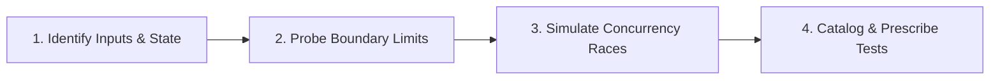

# Edge Case Analysis

Discover boundary conditions, concurrent race windows, numerical anomalies, and extreme user inputs across system designs and code.

## Discovery Workflow

1. **Identify Inputs & State**: Map all user inputs, timestamps, monetary amounts, and state machine transitions.
2. **Probe Boundary Limits**: Test min/max values, zero/negative quantities, leap years, timezone offsets, and Unicode edge cases.
3. **Simulate Concurrency Races**: Check double-submission, simultaneous booking clicks, and token expiration race windows.
4. **Prescribe Unit Tests**: Translate each discovered edge case into a concrete unit or integration test case.

---

## Edge Case Catalogs & Guidelines
* For boundary category checklists (monetary, date/time, string encoding, concurrency), see **[REFERENCE.md](REFERENCE.md)**.