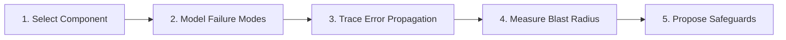

# Failure Scenario Analysis

Analyze how distributed microservices, databases, and third-party integrations behave under partial or total failure.

## Analysis Workflow

1. **Select Component**: Identify target service, background worker, or external API dependency.
2. **Model Failure Modes**: Simulate crash failures, hang/timeouts, data corruption, and dropped connections.
3. **Trace Error Propagation**: Verify error propagation paths using Rust `Result<T, AppError>` combinators (no unhandled panics).
4. **Measure Blast Radius**: Determine which upstream user workflows and dependent services are impacted.
5. **Propose Safeguards**: Add timeouts, circuit breakers, fallback responses, and alerting triggers.

---

## Failure Catalogs & Blast Radius Templates
* For outage simulation matrices and cascading failure checklists, see **[REFERENCE.md](REFERENCE.md)**.