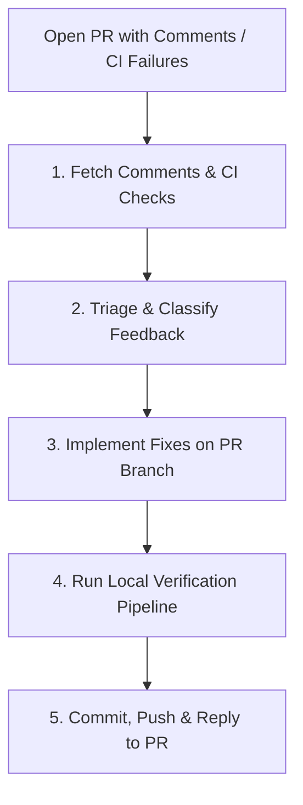

# PR Remediation Loop

Automatically inspect pull request review feedback and failing CI checks, apply code fixes, verify against project invariants, and push updates back to the PR branch.

## Remediation Workflow



### 1. Fetch Comments & CI Status
- Identify the target PR number (e.g. from current branch or argument).
- Fetch all review comments, unresolved threads, and CI statuses using the GitHub CLI:
  ```bash
  gh pr view <pr_number> --json comments,reviews,statusCheckRollup,headRefName
  gh api repos/{owner}/{repo}/pulls/<pr_number>/comments
  ```

### 2. Triage & Classify Feedback
- Categorize each review finding or CI failure:
  - **Actionable Fix**: Unhandled error, edge case bug, broken test, clippy lint, formatting issue.
  - **Policy Violation**: Violates rules in `AGENTS.md` (e.g., `.unwrap()`, float math, blocking async I/O).
  - **Clarification / Non-Goal**: Requests feature out-of-scope of the `intent.md` or `spec.md` (flag for human response).

### 3. Implement Fixes on PR Branch
- Check out the PR branch if not already active (`git checkout <headRefName>`).
- Apply code modifications cleanly to resolve each actionable comment.
- Avoid introducing unrelated refactors or scope creep.

### 4. Run Local Verification Pipeline
- Run project build, lints, and unit tests (e.g. `cargo test`, `cargo clippy`, `npm test`):
  - In this workspace, run [`sanity-check-workflow.md`](file:///home/pav/code/our_places_rs-update-agent-md/.agents/workflows/sanity-check-workflow.md).
- Ensure 0 errors and 0 warnings before pushing.

### 5. Commit, Push & Post Resolution Summary
- Commit changes with clear, traceable commit messages (e.g., `fix(booking_api): address review comment on lock timeouts`).
- Push to the remote branch (`git push origin <headRefName>`).
- Post an update or reply to unresolved review threads summarizing the exact fixes applied.
