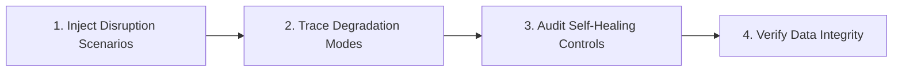

# Resilience Exploration

Evaluate system behavior under adverse conditions, service degradation, network partitions, and resource exhaustion.

## Resilience Review Workflow

1. **Disruption Scenarios**: Model database pool exhaustion, third-party API outages (e.g. currency rate provider), GCS upload failures, and Cold-Start CPU throttling.
2. **Degradation Modes**: Ensure graceful degradation rather than unhandled panics or 500 errors.
3. **Self-Healing Controls**: Audit circuit breakers, exponential backoff retries, and fallback defaults.
4. **Data Integrity**: Verify idempotent state transitions and transaction atomicity.

---

## Resilience Catalogs & Guidelines
* For fault taxonomy, circuit breaker patterns, and idempotency checklists, see **[REFERENCE.md](REFERENCE.md)**.