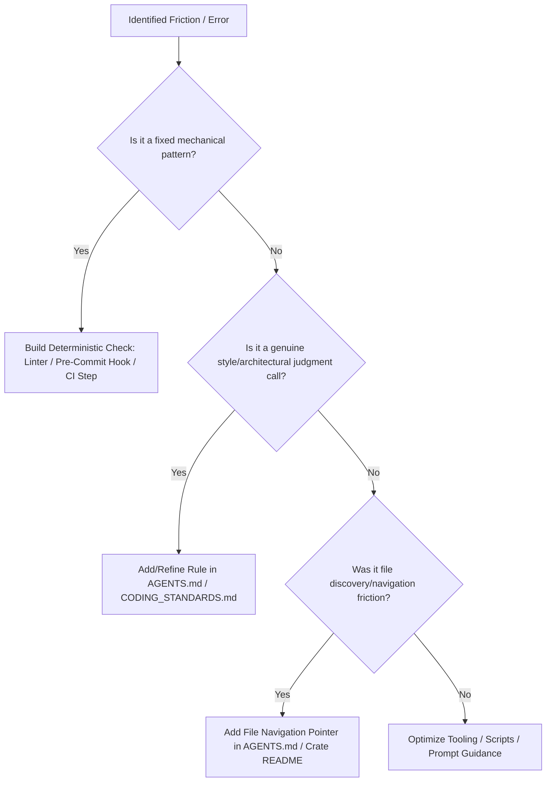

# Retro Skill Reference & Guidelines

Deep operational reference for conducting agent session retrospectives and optimizing project environments.

---

## 1. Candidate Classification Decision Tree

When evaluating friction points identified during a session, classify each candidate before formulating recommendations:



---

## 2. Steering Files vs. Deterministic Checks

| Finding Type | Primary Target | Anti-Pattern to Avoid |
| :--- | :--- | :--- |
| **Mechanical Violation** (syntax, imports, unwrap, sqlx update) | Custom linter rule, pre-commit hook script, CI workflow step | Writing a lengthy paragraph in `AGENTS.md` asking the model not to forget a check |
| **Architectural / Domain Standard** (tri-currency, row locking, error mapping) | `AGENTS.md` (Key Domain Rules & Constraints) | Creating a complex regex script for nuanced business domain invariants |
| **File Navigation Friction** (took multiple searches to locate models) | `AGENTS.md` (Monorepo Crate Architecture) | Adding unnecessary top-level files without updating crate READMEs |
| **Missing Guardrail** (no pre-commit hook, missing CI check) | `.githooks/pre-commit` or `.github/workflows/ci.yml` | Assuming the developer will manually execute lint scripts |

---

## 3. Writing for Agents Style Guide (`writing-for-agents`)

When updating steering files (`AGENTS.md`, `CODING_STANDARDS.md`, `SKILL.md`):

1. **Terse & Direct**: Avoid conversational filler, preambles, or background storytelling. Use imperative bullet points.
2. **Explicit Negative Constraints**: Include explicit "NEVER" lists for high-risk invariants (e.g. `NEVER use f32/f64 for money`).
3. **Clickable File Links**: Include explicit markdown links with the `file://` scheme so agents can directly jump to definitions.
4. **Concrete Examples**: Provide minimal inline code/diff snippets demonstrating correct vs incorrect patterns.

---

## 4. Retrospective Report Template

```markdown
# Session Retrospective Report

**Target Session**: [Session ID / Prompt Description]  
**Retrospective Date**: [YYYY-MM-DD]  

## 1. Summary of Session Friction
- **Observation 1**: Agent spent 4 tool calls searching for static tax rate definitions before finding `common/src/reference.rs`.
- **Observation 2**: SQL query was updated in `db_core` without running `cargo sqlx prepare`, causing offline CI query check failure.

## 2. Actionable Environment Improvements

### 1. Navigation Pointer for Common Reference Data
- **Category**: Navigation
- **Enforcement Target**: `AGENTS.md` (Section 4)
- **Consequence**: 4 extra file search tool calls (~120s delay).
- **Recommendation**:
  Add an explicit navigation pointer for statutory tax rates:
  - Statutory Tax Rates (15% GCT): Defined in [`common/src/reference.rs`](file:///home/pav/code/our_places_rs-update-agent-md/common/src/reference.rs).

### 2. Pre-Commit / Pre-CI SQLx Prepared Query Check
- **Category**: Automated Checks & Guardrails
- **Enforcement Target**: Pre-commit hook / `cargo sqlx prepare --check`
- **Consequence**: Failed CI build on branch push due to missing `sqlx-data.json` synchronization.
- **Recommendation**:
  Wire `cargo sqlx prepare --check` into pre-commit guardrail.
```
