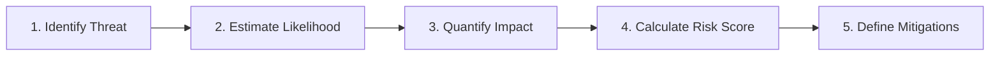

# Risk Assessment

Quantify and prioritize technical, operational, and architectural risks to guide engineering and security decisions.

## Assessment Process

1. **Threat Identification**: Detail threat actors, failure modes, and vulnerability preconditions.
2. **Likelihood Estimation**: Score probability based on ease of exploitation and exposure (1 = Rare, 5 = Frequent).
3. **Impact Quantification**: Score damage to data integrity, financial accuracy, uptime, and user trust (1 = Negligible, 5 = Catastrophic).
4. **Calculate Risk**: $\text{Risk Level} = \text{Likelihood} \times \text{Impact}$.
5. **Formulate Mitigations**: Specify architectural safeguards, defense-in-depth controls, or acceptance criteria.

---

## Risk Matrices & Templates
* For $5 \times 5$ risk scoring grids, impact criteria, and risk register templates, see **[REFERENCE.md](REFERENCE.md)**.
