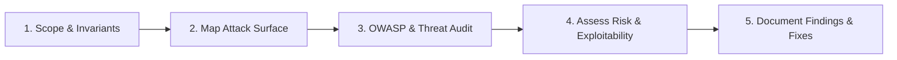

# Security Review

Evaluate system architectures, API endpoints, and code changes for security vulnerabilities, attack vectors, and policy compliance.

## Review Perspective
Assume weaknesses and untrusted boundaries exist until proven otherwise. Scrutinize input validation, authentication, authorization, cryptography, and secrets management.

---

## 5-Step Review Workflow

1. **Scope & Invariants**: Inspect architecture docs, API contracts, and PR diffs. Identify trust boundaries and statutory compliance rules.
2. **Map Attack Surface**: Trace external input entrypoints, database queries, auth extractors, and third-party integrations.
3. **OWASP & Threat Audit**: Check for injection, broken auth, SSRF, IDOR, sensitive data exposure, and CSRF.
4. **Assess Risk**: Classify findings by severity (Critical, High, Medium, Low) and exploitability.
5. **Document Findings**: Output concrete findings with code snippets and remediation fixes.

---

## Detailed Checklists & Templates
* For OWASP Top 10 evaluation rubrics and standard findings report templates, see **[REFERENCE.md](REFERENCE.md)**.
