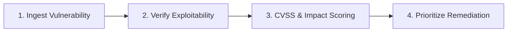

# Vulnerability Analysis

Analyze discovered security vulnerabilities, SAST/DAST findings, and dependency CVEs to determine real-world exploitability and remediation priorities.

## Analysis Protocol

1. **Ingest Vulnerability**: Parse scanner reports (`cargo audit`, Snyk, Dependabot) or static review findings.
2. **Verify Exploitability**: Determine if vulnerable code paths are reachable from external interfaces or user input.
3. **Score Impact**: Evaluate blast radius across confidentiality, data integrity, and system availability.
4. **Prioritize Remediation**: Classify into remediation tiers (P0: Patch within 24h, P1: Current sprint, P2: Scheduled maintenance).

---

## Detailed Classification Matrices & Templates
* For CVSS v3.1 scoring formulas, reachability verification steps, and remediation plans, see **[REFERENCE.md](REFERENCE.md)**.
