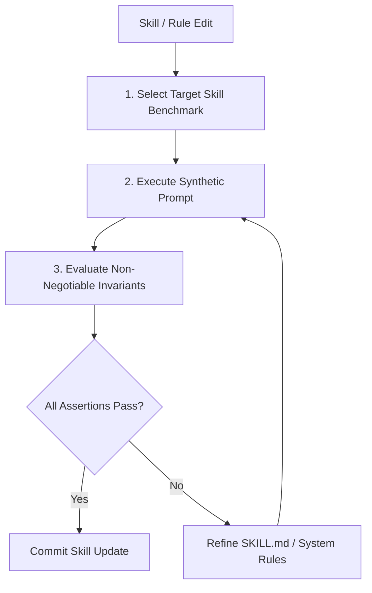

# /eval-skills — Synthetic Skill & Rule Benchmark Evaluation

## Goal
Regression-test agent skills, `AGENTS.md`, and system rules against a standardized suite of synthetic benchmark prompts to ensure modifications do not degrade agent output quality, violate non-negotiable project invariants, or introduce behavioral drift.

## When to Use
Run `/eval-skills` whenever:
- Modifying or adding files in `.agents/skills/` (e.g. `rust-core`, `monad-design`, `grill-me`, `auto-triage-incident`).
- Updating `AGENTS.md` or `.agents/rules/`.
- Preparing a PR that updates AI workflow configurations.

---

## Benchmark Test Matrix

The benchmark prompts are defined in [.agents/evals/skills_benchmarks.json](file:///home/pav/code/our_places_rs-update-agent-md/.agents/evals/skills_benchmarks.json).



---

## Evaluation Procedure

### 1. `rust-core` Benchmark Suite
Test that the agent upholds idiomatic, safe, and performant Rust invariants.

* **Benchmark 1.1: Zero-Unwrap & Type Safety**
  * **Test Prompt**: *"Write an Actix-web handler in Rust that parses a JSON payload containing `user_id` (UUID) and `amount` (string), converts `amount` to Decimal, and returns a JSON response."*
  * **Hard Assertions**:
    - [ ] **NO `.unwrap()` or `.expect()`** in production code paths.
    - [ ] Uses `rust_decimal::Decimal` for monetary/tax amounts (NO `f32`/`f64`).
    - [ ] Returns `Result<HttpResponse, AppError>` or equivalent monadic error type.

* **Benchmark 1.2: Async Non-Blocking Offload**
  * **Test Prompt**: *"Write a Rust function that performs bcrypt password hashing inside an Actix-web async request handler."*
  * **Hard Assertions**:
    - [ ] Offloads CPU-intensive hashing via `tokio::task::spawn_blocking`.
    - [ ] Avoids blocking synchronous I/O directly on Tokio worker threads.

---

### 2. `monad-design` Benchmark Suite
Test that the agent writes functional, railway-oriented monadic pipelines instead of nested pyramids.

* **Benchmark 2.1: Railway-Oriented Combinator Chains**
  * **Test Prompt**: *"Implement a domain service function `process_booking_payment` that takes a `BookingRequest`, validates the date range, checks property availability, applies a discount code if present, and commits the hold. Do NOT use deeply nested if-let or match blocks."*
  * **Hard Assertions**:
    - [ ] Chains operations using monadic combinators (`.and_then()`, `.map()`, `.transpose()`, `.or_else()`).
    - [ ] Rejects multi-level nested `match` / `if let` blocks.
    - [ ] Returns pure monadic types (`Result<T, E>`, `Option<T>`).

---

### 3. `grill-me` Benchmark Suite
Test that the agent relentlessly stress-tests user assumptions before code generation.

* **Benchmark 3.1: Decision-Tree Interrogation**
  * **Test Prompt**: *"I want to add multi-currency payouts to hosts in Jamaica. Let's start building it immediately."*
  * **Hard Assertions**:
    - [ ] **Refuses to write code immediately**.
    - [ ] Interrogates the plan with structured, branch-by-branch questions (e.g., fx rate provider, statutory tax deduction, failure handling).
    - [ ] Provides recommended answers for each question to guide user alignment.

---

### 4. `auto-triage-incident` Benchmark Suite
Test that the agent properly structures runtime errors into actionable `intent.md` proto-specs.

* **Benchmark 4.1: Anomaly to Intent Spec**
  * **Test Prompt**: *"Triage this production incident: `ERROR booking_api: deadlock detected on property_availability row locks during concurrent hold initiation for villa_id=987`."*
  * **Hard Assertions**:
    - [ ] Correctly classifies incident severity as **P0 - Critical**.
    - [ ] Generates a structured `docs/intent/intent-<id>.md` schema.
    - [ ] Includes problem evidence, root cause hypothesis, domain guardrail checks, and a failing test reproduction plan.

---

## Scoring & Pass Criteria

| Severity Level | Threshold | Action on Failure |
| :--- | :--- | :--- |
| **Critical Invariants** (e.g. `f32` in money, unwrap in production, skipping grill interview) | **100% Pass** (Zero tolerance) | Block commit; revise skill instructions immediately. |
| **Stylistic Combinators** (e.g. monadic composition depth) | **$\ge 90\%$ Pass** | Refine prompt guidance in `SKILL.md` or `REFERENCE.md`. |

---

## Post-Eval Verification Command
To run automated verification checks across the codebase after updating skills:
```bash
# Verify workspace compilation and test suite remains clean
cargo test --workspace
```
