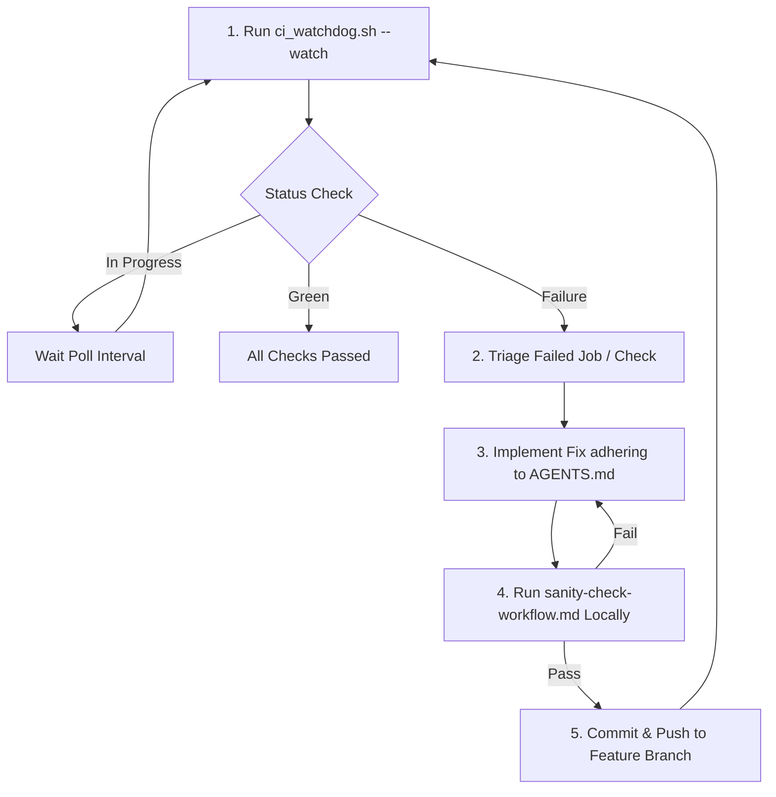

# /gha-watchdog — Continuous CI/CD Watchdog & Self-Healing Loop

## Goal
Continually monitor GitHub Actions (GHA) CI/CD build pipelines and PR checks. When a failure is detected, extract failure diagnostics, apply targeted fixes complying with project invariants (`AGENTS.md`), execute local sanity checks, commit, and push back to the remote branch until all checks pass.

---

## Autonomous Remediation Loop



---

## 1. Monitor Pipeline Status
Run the watchdog helper in check or watch mode:
```bash
./scripts/ci_watchdog.sh
# Or continuous monitoring:
./scripts/ci_watchdog.sh --watch
```

## 2. Extract Diagnostics & Triage
When failures occur:
- **GHA Job Failures**:
  ```bash
  gh run view <run_id> --log-failed
  # Or specific job log:
  gh run view --job=<job_id> --log
  ```
- **PR Check Annotations (SonarCloud / DeepSource)**:
  ```bash
  gh api repos/{owner}/{repo}/commits/<head_sha>/check-runs
  gh api repos/{owner}/{repo}/check-runs/<check_run_id>/annotations
  ```

## 3. Implement Surgical Fixes
Apply code modifications adhering to `AGENTS.md`:
- **No Float Math**: Use `rust_decimal::Decimal` exclusively.
- **No Panics**: Zero `.unwrap()` / `.expect()`; use monadic `Result` and `Option` combinators.
- **SQLx Cache**: If queries change, update cache with `cargo sqlx prepare --workspace -- --all-targets`.
- **Security / Static Analysis**:
  - Avoid hardcoded `/tmp` paths; use `std::env::temp_dir()`.
  - Add `<html lang="en">` to HTML templates.
  - Multi-line SQL strings inside `cron.schedule` should use standard escaping or dollar quoting.

## 4. Mandatory Local Gate
Before any push, execute the complete sanity check sequence:
```bash
# 1. Format
cargo fmt --check

# 2. Clippy
SQLX_OFFLINE=true cargo clippy --workspace --exclude protoproj --all-features -- -D warnings

# 3. Unit & Integration Tests
cargo test --verbose --workspace --exclude web_app_tc --exclude web_app_admin_tc --exclude web_app_common_tc --exclude protoproj
cargo test -p web_app_tc -p web_app_common_tc --verbose
cargo test -p web_app_admin_tc --verbose
```

## 5. Commit, Push & Resume Watch
```bash
git branch -vv # Verify tracking branch
git commit -am "fix(<component>): address <job_name> CI check failure"
git push origin <branch_name>
./scripts/ci_watchdog.sh --watch
```
