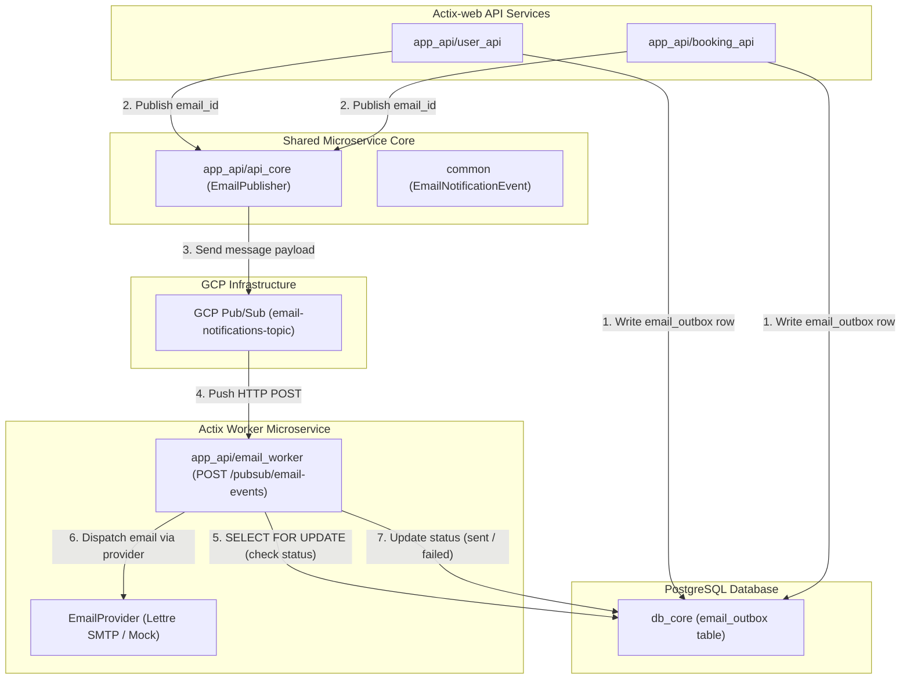

# Spec 33: Event-Driven Pub/Sub Queue for Asynchronous Email Delivery

## Overview

Transactional email communication—such as registration verification OTPs, password resets, booking confirmations, and guest-host messaging notifications—is a critical operational subsystem of the **Our Places** platform. 

Prior to this feature, transactional emails were either stubbed out synchronously via `tracing::info!` or executed in-line during HTTP request processing. Synchronous email dispatch introduces significant operational risks:
1. **API Handler Latency**: HTTP request handlers block on external SMTP/API network calls, inflating response latency.
2. **Failure Vulnerability & Loss of Context**: Transient SMTP outages cause user-facing request failures or result in silent notification loss without audit logs or retry state tracking.
3. **Lack of Idempotency**: Network retries at the client or gateway level can result in duplicate email sends.

This specification details the architecture, design, security posture, performance considerations, and test strategy for an **Event-Driven Outbox & Pub/Sub Queue System for Asynchronous Email Delivery**.

Under this system:
1. Upstream APIs (`user_api`, `booking_api`) insert an email record into a PostgreSQL `email_outbox` database table within the local transaction scope.
2. After transaction commit, the service publishes a lightweight event (`EmailNotificationEvent { email_id: Uuid }`) to Google Cloud Pub/Sub.
3. Google Cloud Pub/Sub delivers the event via HTTP POST push notification to a dedicated Cloud Run background worker service (`app_api/email_worker`).
4. The `email_worker` acquires a PostgreSQL row lock (`SELECT ... FOR UPDATE`), validates the current email state, dispatches the email via the configured provider (`lettre` SMTP or `MockEmailProvider`), and atomically updates the status (`sent` or `failed`).
5. Retries for transient failures are executed internally within `email_worker` up to a configurable maximum attempt threshold (`MAX_EMAIL_RETRIES`, defaulting to `3`). Failed emails are **not** re-published back to Pub/Sub, and no Dead-Letter Queue (DLQ) is used.

---

## Requirements & Scope Boundaries

### In Scope
- **Database Architecture (`db_core`)**:
  - `email_outbox` table in PostgreSQL with columns `id`, `recipient_email`, `subject`, `template_id`, `payload` (JSONB), `status`, `attempts`, `max_retries`, `last_error`, `sent_at`, `created_at`, `updated_at`.
  - Compile-time verified SQLx query functions for atomic status transitions and row-level locking (`SELECT ... FOR UPDATE`).
- **Domain Models & Events (`common`)**:
  - `EmailStatus` enum (`Pending`, `Processing`, `Sent`, `Failed`).
  - `EmailNotificationEvent` DTO with Serde JSON serialization.
  - `EmailTemplate` enum (`UserVerificationOtp`, `PasswordResetOtp`, `BookingConfirmation`, `GuestHostMessageNotification`).
- **Pub/Sub Integration (`app_api/api_core`)**:
  - `EmailPublisher` client helper for publishing `EmailNotificationEvent` messages to GCP Pub/Sub `EMAIL_PUBSUB_TOPIC_ID`.
- **Worker Microservice (`app_api/email_worker`)**:
  - Actix-web background worker receiving GCP Pub/Sub Push HTTP POST requests at `POST /pubsub/email-events`.
  - Pub/Sub Push header/envelope decoding and authentication token validation.
  - Pluggable `EmailProvider` async trait with `MockEmailProvider` (dev/test) and `LettreSmtpEmailProvider` (prod).
  - In-app retry loop with configurable exponential backoff governed by `MAX_EMAIL_RETRIES` (default `3`).
- **Service Refactoring (`user_api`, `booking_api`)**:
  - Refactor `user_api` (verification OTP, password reset OTP) and `booking_api` (booking confirmation, guest-host messaging) to write to `email_outbox` and emit Pub/Sub events.
- **Infrastructure & Configuration (`infra`, `.env`)**:
  - `Dockerfile.image_worker` style multi-stage Docker build for `Dockerfile.email_worker`.
  - Terraform / Pulumi GCP Pub/Sub Topic (`email-notifications-topic`) and Push Subscription configuration with `ackDeadlineSeconds = 30s`.


### Out of Scope
- Dead-Letter Queue (DLQ) setup or Pub/Sub topic re-queueing (failures handled in-app per explicit policy).
- WYSIWYG or visual HTML email template builders.
- Bulk marketing or newsletter emails (strictly transactional MVP).

---

## 1. Technical Specification

### 1.1. High-Level Component & Architecture Flow



---

### 1.2. Database Schema & Entities (`db_core`)

#### Migration: `db_core/migrations/20260924000000_create_email_outbox_table.sql`
```sql
CREATE TYPE email_status AS ENUM ('pending', 'processing', 'sent', 'failed');

CREATE TABLE email_outbox (
    id UUID PRIMARY KEY DEFAULT gen_random_uuid(),
    recipient_email VARCHAR(255) NOT NULL,
    subject VARCHAR(255) NOT NULL,
    template_id VARCHAR(100) NOT NULL,
    payload JSONB NOT NULL DEFAULT '{}'::jsonb,
    status email_status NOT NULL DEFAULT 'pending',
    attempts INT NOT NULL DEFAULT 0,
    max_retries INT NOT NULL DEFAULT 3,
    last_error TEXT,
    sent_at TIMESTAMPTZ,
    created_at TIMESTAMPTZ NOT NULL DEFAULT NOW(),
    updated_at TIMESTAMPTZ NOT NULL DEFAULT NOW()
);

-- Index for efficient querying and status auditing
CREATE INDEX idx_email_outbox_status_created ON email_outbox (status, created_at DESC);
CREATE INDEX idx_email_outbox_recipient ON email_outbox (recipient_email);

-- Retention cleanup procedure (executed by existing database cleanup cron job)
-- Purges completed outbox records older than 30 days to prevent table bloat
DELETE FROM email_outbox WHERE status = 'sent' AND created_at < NOW() - INTERVAL '30 days';
```

#### SQLx Query Functions (`db_core/src/email_outbox.rs`)
- `insert_email_outbox(pool, req) -> Result<EmailOutbox, DbError>`: Creates a new outbox entry with `status = 'pending'`.
- `get_email_outbox_for_update(tx, id) -> Result<Option<EmailOutbox>, DbError>`: Fetches outbox record using `SELECT * FROM email_outbox WHERE id = $1 FOR UPDATE`.
- `mark_email_processing(tx, id, current_attempts) -> Result<(), DbError>`: Sets `status = 'processing'` and increments `attempts = current_attempts + 1`.
- `mark_email_sent(pool, id) -> Result<(), DbError>`: Sets `status = 'sent'` and `sent_at = NOW()`.
- `mark_email_failed(pool, id, last_error) -> Result<(), DbError>`: Sets `status = 'failed'` and updates `last_error`.

---

### 1.3. Domain Models, Event Structs & Type State Pattern (`common`)

```rust
// common/src/email.rs

use serde::{Deserialize, Serialize};
use std::marker::PhantomData;
use uuid::Uuid;

#[derive(Debug, Clone, Copy, PartialEq, Eq, Serialize, Deserialize)]
#[serde(rename_all = "snake_case")]
pub enum EmailStatus {
    Pending,
    Processing,
    Sent,
    Failed,
}

#[derive(Debug, Clone, Serialize, Deserialize)]
pub struct EmailNotificationEvent {
    pub email_id: Uuid,
}

#[derive(Debug, Clone, Serialize, Deserialize)]
#[serde(rename_all = "snake_case")]
pub enum EmailTemplate {
    UserVerificationOtp,
    PasswordResetOtp,
    BookingConfirmation,
    GuestHostMessageNotification,
}

// ============================================================================
// Type State Pattern for Compile-Time Guaranteed Email State Transitions
// ============================================================================

pub struct PendingState;
pub struct ProcessingState;
pub struct SentState;
pub struct FailedState;

pub struct EmailRecord<State> {
    pub id: Uuid,
    pub recipient_email: String,
    pub subject: String,
    pub template_id: String,
    pub payload: serde_json::Value,
    pub attempts: i32,
    pub max_retries: i32,
    pub last_error: Option<String>,
    _state: PhantomData<State>,
}

impl EmailRecord<PendingState> {
    pub fn new(
        id: Uuid,
        recipient_email: String,
        subject: String,
        template_id: String,
        payload: serde_json::Value,
        max_retries: i32,
    ) -> Self {
        Self {
            id,
            recipient_email,
            subject,
            template_id,
            payload,
            attempts: 0,
            max_retries,
            last_error: None,
            _state: PhantomData,
        }
    }

    /// Transition from Pending -> Processing (increments attempts)
    pub fn start_processing(self) -> EmailRecord<ProcessingState> {
        EmailRecord {
            id: self.id,
            recipient_email: self.recipient_email,
            subject: self.subject,
            template_id: self.template_id,
            payload: self.payload,
            attempts: self.attempts + 1,
            max_retries: self.max_retries,
            last_error: self.last_error,
            _state: PhantomData,
        }
    }
}

impl EmailRecord<ProcessingState> {
    /// Transition from Processing -> Sent
    pub fn mark_sent(self) -> EmailRecord<SentState> {
        EmailRecord {
            id: self.id,
            recipient_email: self.recipient_email,
            subject: self.subject,
            template_id: self.template_id,
            payload: self.payload,
            attempts: self.attempts,
            max_retries: self.max_retries,
            last_error: None,
            _state: PhantomData,
        }
    }

    /// Transition from Processing -> Failed
    pub fn mark_failed(self, error_message: String) -> EmailRecord<FailedState> {
        EmailRecord {
            id: self.id,
            recipient_email: self.recipient_email,
            subject: self.subject,
            template_id: self.template_id,
            payload: self.payload,
            attempts: self.attempts,
            max_retries: self.max_retries,
            last_error: Some(error_message),
            _state: PhantomData,
        }
    }
}
```

---

### 1.4. Pub/Sub Publisher Client (`app_api/api_core`)

```rust
// app_api/api_core/src/email_publisher.rs

use common::email::EmailNotificationEvent;
use reqwest::Client;
use tracing::{error, info, instrument};
use uuid::Uuid;

#[derive(Clone)]
pub struct EmailPublisher {
    http_client: Client,
    topic_url: String,
    auth_token: Option<String>,
}

impl EmailPublisher {
    pub fn new(topic_id: &str) -> Self {
        let topic_url = format!(
            "https://pubsub.googleapis.com/v1/projects/{}/topics/{}:publish",
            std::env::var("GCP_PROJECT_ID").unwrap_or_default(),
            topic_id
        );
        Self {
            http_client: Client::new(),
            topic_url,
            auth_token: std::env::var("PUBSUB_AUTH_TOKEN").ok(),
        }
    }

    #[instrument(skip(self))]
    pub async fn publish_email_event(&self, email_id: Uuid) -> Result<(), crate::AppError> {
        let event = EmailNotificationEvent { email_id };
        let payload_bytes = serde_json::to_vec(&event)
            .map_err(|e| crate::AppError::InternalServerError(e.to_string()))?;
        
        let base64_data = base64::encode(payload_bytes);
        
        let pubsub_body = serde_json::json!({
            "messages": [{
                "data": base64_data
            }]
        });

        let mut req = self.http_client.post(&self.topic_url).json(&pubsub_body);
        if let Some(token) = &self.auth_token {
            req = req.bearer_auth(token);
        }

        let res = req.send().await.map_err(|e| {
            error!("Failed to publish email event to Pub/Sub: {}", e);
            crate::AppError::InternalServerError("PubSub publish failed".into())
        })?;

        if res.status().is_success() {
            info!("Successfully published email event for email_id {}", email_id);
            Ok(())
        } else {
            let err_text = res.text().await.unwrap_or_default();
            error!("Pub/Sub publish returned error status: {}", err_text);
            Err(crate::AppError::InternalServerError("PubSub publish error response".into()))
        }
    }
}
```

---

### 1.5. Worker Microservice Architecture (`app_api/email_worker`)

#### Crate Structure
```
app_api/email_worker/
├── Cargo.toml
├── src/
│   ├── main.rs
│   ├── apis.rs
│   ├── config.rs
│   ├── provider.rs
│   └── processor.rs
```

#### Pub/Sub Push Envelope Schema
```rust
#[derive(Deserialize)]
pub struct PubSubPushEnvelope {
    pub message: PubSubMessage,
}

#[derive(Deserialize)]
pub struct PubSubMessage {
    pub data: String, // Base64 encoded JSON payload
    pub message_id: String,
}
```

#### EmailProvider Trait & Implementations (`provider.rs`)
```rust
#[async_trait::async_trait]
pub trait EmailProvider: Send + Sync {
    async fn send_email(&self, recipient: &str, subject: &str, body: &str) -> Result<(), String>;
}

pub struct MockEmailProvider;

#[async_trait::async_trait]
impl EmailProvider for MockEmailProvider {
    async fn send_email(&self, recipient: &str, subject: &str, body: &str) -> Result<(), String> {
        tracing::info!("[MOCK EMAIL DISPATCH] To: {}, Subject: {}", recipient, subject);
        Ok(())
    }
}

pub struct LettreSmtpEmailProvider {
    // Configured via SMTP_HOST, SMTP_PORT, SMTP_USERNAME, SMTP_PASSWORD, SMTP_FROM_EMAIL
}
```

#### Execution & In-App Retry Logic (`processor.rs`)
```rust
pub async fn process_email_event(
    pool: &PgPool,
    provider: &dyn EmailProvider,
    email_id: Uuid,
    max_retries: i32,
) -> Result<(), String> {
    // 1. Claim job & check idempotency in a short atomic DB transaction
    let mut tx = pool.begin().await.map_err(|e| e.to_string())?;
    
    let record = db_core::email_outbox::get_email_outbox_for_update(&mut tx, email_id)
        .await
        .map_err(|e| e.to_string())?;

    let record = match record {
        Some(r) => r,
        None => {
            tracing::warn!("Email record {} not found in outbox", email_id);
            return Ok(());
        }
    };

    // Idempotency check: if already sent, exit cleanly
    if record.status == EmailStatus::Sent {
        tracing::info!("Email {} already sent. Skipping.", email_id);
        return Ok(());
    }

    let mut attempt = record.attempts;
    db_core::email_outbox::mark_email_processing(&mut tx, email_id, attempt + 1)
        .await
        .map_err(|e| e.to_string())?;
    
    // Commit transaction to release row lock BEFORE network I/O
    tx.commit().await.map_err(|e| e.to_string())?;

    // 2. In-app retry execution loop (External Network I/O decoupled from DB locks)
    let mut last_err = None;
    let body = render_email_body(&record.template_id, &record.payload);

    while attempt < max_retries {
        attempt += 1;
        
        // Enforce strict 3-second timeout per SMTP dispatch attempt
        let send_fut = provider.send_email(&record.recipient_email, &record.subject, &body);
        match tokio::time::timeout(std::time::Duration::from_secs(3), send_fut).await {
            Ok(Ok(())) => {
                db_core::email_outbox::mark_email_sent(pool, email_id).await.map_err(|e| e.to_string())?;
                tracing::info!("Email {} successfully dispatched on attempt {}", email_id, attempt);
                return Ok(());
            }
            Ok(Err(e)) => {
                tracing::warn!("Attempt {} failed for email {}: {}", attempt, email_id, e);
                last_err = Some(e);
            }
            Err(_) => {
                let timeout_err = format!("Attempt {} timed out after 3 seconds", attempt);
                tracing::warn!("{}", timeout_err);
                last_err = Some(timeout_err);
            }
        }

        if attempt < max_retries {
            // Exponential backoff delay within application worker
            tokio::time::sleep(tokio::time::Duration::from_millis(100 * (2u64.pow(attempt as u32)))).await;
        }
    }


    // 3. Retries exhausted: mark as failed without re-queueing on Pub/Sub
    let err_msg = last_err.unwrap_or_else(|| "Max retries exceeded".into());
    db_core::email_outbox::mark_email_failed(pool, email_id, &err_msg)
        .await
        .map_err(|e| e.to_string())?;

    tracing::error!("Email {} permanently failed after {} attempts: {}", email_id, max_retries, err_msg);
    Ok(())
}
```


---

## 2. Performance Considerations

1. **Big-O Execution Time**:
   - Outbox insert: $O(1)$ single-row insertion.
   - Pub/Sub event publish: $O(1)$ HTTP request.
   - Worker event handling: $O(1)$ primary key lookup (`SELECT ... WHERE id = $1 FOR UPDATE`) and single-row status update.
2. **Zero N+1 Queries**:
   - Each event processes exactly one email record by primary key `id`.
3. **HTTP Response Non-Blocking Guarantee**:
   - Upstream API handlers (`user_api`, `booking_api`) return HTTP responses immediately after committing the outbox record and spawning background event publishing. Response times are unaffected by external SMTP network conditions.
4. **Cloud Run Scale-to-Zero & Pub/Sub Push Wakeup**:
   - When `email_worker` is scaled to 0 instances (`min-instances = 0`), it consumes zero CPU/RAM resources.
   - Upon publishing an `EmailNotificationEvent`, GCP Pub/Sub sends an HTTPS POST push notification to the Cloud Run service URL (`POST /pubsub/email-events`).
   - Google Cloud Run automatically intercepts the incoming HTTP POST request, provisions/wakes up a container instance (triggering a fast cold start), processes the event, and returns a 200 OK response.
   - Binary footprint < 15MB, cold start time < 150ms (p50) / < 500ms (p95), RAM usage < 60MB, fully respecting Cloud Run limits ($0.25\text{ vCPU}$, $256\text{MB RAM}$).


---

## 3. Security Mitigations

1. **Pub/Sub Push Authentication**:
   - The `POST /pubsub/email-events` endpoint validates incoming requests against a shared secret header (`X-PubSub-Secret-Token`) or Google Cloud OIDC Bearer tokens to prevent unauthorized external invocation.
2. **PII & Sensitive Token Safeguards**:
   - Verification OTP codes and password reset tokens in email bodies are treated as sensitive data. They are never written to unencrypted `tracing` logs or application stdout in production.
3. **Compile-Time SQL Safety**:
   - All PostgreSQL interactions in `db_core` use `sqlx::query!` macros to prevent SQL injection vulnerabilities.
4. **Recipient Email Sanitization**:
   - All email addresses are validated using strict RFC 5322 format rules via `validator::validate_email` prior to insertion into `email_outbox`.

---

## 4. Test Plan

### 4.1. Unit Tests
- **`common` Unit Tests**:
  - Test serialization/deserialization of `EmailNotificationEvent` and `EmailStatus` enum variants.
- **`db_core` Unit Tests**:
  - Verify validation rules for `EmailOutbox` field boundaries.
- **`email_worker` Unit Tests**:
  - Test `MockEmailProvider` dispatch behavior.
  - Test in-app retry loop with mock provider errors up to `MAX_EMAIL_RETRIES` (3).

### 4.2. Integration Tests
- **Database Integration (`db_core`)**:
  - Test atomic transaction behavior when inserting outbox records.
  - Test row lock acquiring (`SELECT ... FOR UPDATE`) and status transitions (`pending` $\rightarrow$ `processing` $\rightarrow$ `sent` / `failed`).
- **Upstream API Integration (`user_api`, `booking_api`)**:
  - Execute registration flow and verify `email_outbox` row creation for verification OTP.
  - Execute booking message post flow and verify `email_outbox` row creation for message notification.
- **Worker Push Handler Integration (`email_worker`)**:
  - Send simulated Pub/Sub Push HTTP POST requests to `POST /pubsub/email-events` and verify state changes in PostgreSQL.

### 4.3. Concurrency & Reliability Tests
- **Duplicate Event Idempotency Test**:
  - Deliver identical Pub/Sub push messages twice sequentially; verify `email_worker` processes the email exactly once and ignores the duplicate.
- **Max Retries Threshold Test**:
  - Inject persistent email provider failure; verify worker executes up to `MAX_EMAIL_RETRIES` (3) in-app retries, sets status to `failed`, and returns 200 OK to Pub/Sub without re-queueing or DLQ creation.
