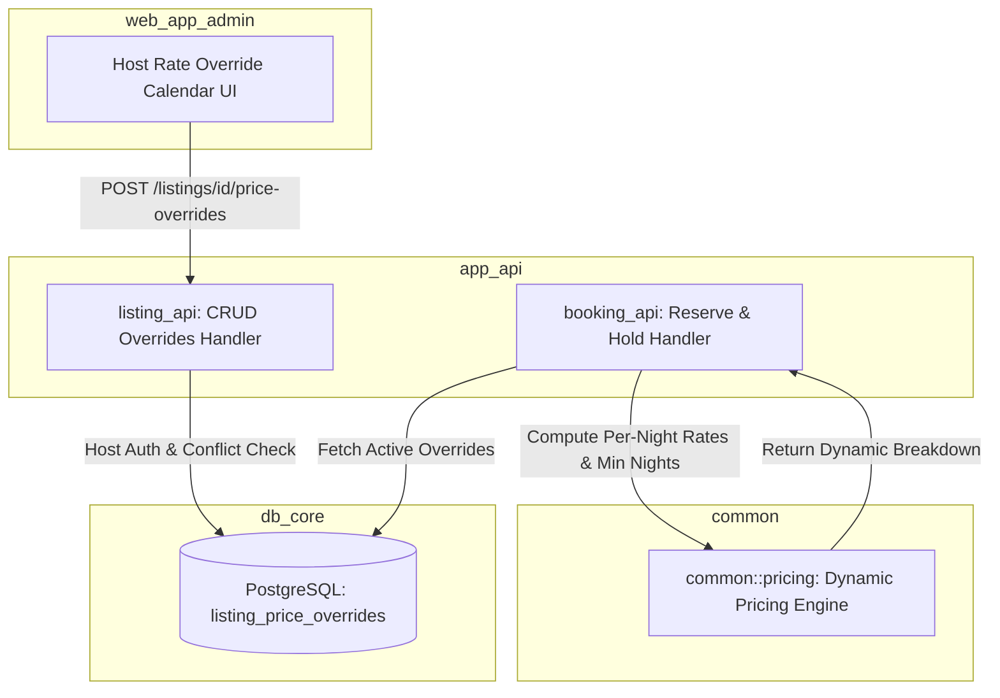

# Spec 57: Dynamic Seasonal Pricing & Custom Date Overrides

## Overview

In short-term luxury property management, static nightly pricing limits revenue potential during peak demand periods (such as Christmas/New Year holidays, festival weekends, and high-season months) while failing to offer competitive rates during off-peak periods.

This specification details the design and implementation of **Dynamic Seasonal Pricing and Custom Date Rate Overrides** for the Our Places platform. Villa hosts will be able to configure date-specific nightly rates and minimum night stay requirements for their properties. The isomorphic pricing engine (`common::pricing`), backend services (`db_core`, `listing_api`, `booking_api`), and frontend management interfaces (`web_app_admin`, `web_app_common`, `web_app`) will be updated to seamlessly evaluate dynamic rate overrides while upholding financial precision, strict concurrency control, and Cloud Run scale-to-zero efficiency constraints.

---

## Requirements

### 1. Database Schema (`db_core`)
- **Table Creation**: Add `listing_price_overrides` table in `db_core/migrations/` to store date-specific price and minimum night stay rules per listing.
- **Fields**:
  - `id`: `UUID` (Primary Key, default `gen_random_uuid()`)
  - `listing_id`: `UUID` (Foreign Key referencing `listing(id)` ON DELETE CASCADE)
  - `start_date`: `DATE` (Start of override period, inclusive check-in date)
  - `end_date`: `DATE` (End of override period, exclusive check-out date, where `end_date > start_date`)
  - `nightly_rate`: `NUMERIC(12, 2)` (`rust_decimal::Decimal`, strictly positive `> 0`)
  - `min_nights`: `INT` (Minimum night stay requirement for stays overlapping this period, `>= 1`, default 1)
  - `created_at`: `TIMESTAMPTZ` (Default `NOW()`)
  - `updated_at`: `TIMESTAMPTZ` (Default `NOW()`)
- **Database Integrity & Constraints**:
  - `CHECK (end_date > start_date)`
  - `CHECK (nightly_rate > 0)`
  - `CHECK (min_nights >= 1)`
  - PostgreSQL exclusion constraint via `btree_gist` (`EXCLUDE USING gist (listing_id WITH =, daterange(start_date, end_date, '[)') WITH &&)`) to enforce non-overlapping date range overrides at the database engine level.
- **Index**: Index on `(listing_id, start_date, end_date)` for fast range queries.

### 2. Isomorphic Domain Logic (`common::pricing`)
- **Override Models**: Define `PriceOverride` and `NightlyRateBreakdown` DTOs in `common::models` / `common::pricing`.
- **Dynamic Nightly Rate Resolution**:
  - Implement dynamic stay subtotal calculation that evaluates each night in a stay $[D_{\text{check\_in}}, D_{\text{check\_out}})$ against active price overrides.
  - If a night falls within an override period, use the override `nightly_rate`.
  - If no override covers the night, fall back to the listing's base `nightly_rate`.
  - Sum the per-night rates to produce `sub_total_price` and calculate the weighted effective daily rate.
- **Minimum Nights Rule Evaluation**:
  - If a stay overlaps with one or more override periods specifying `min_nights`, the effective minimum night requirement for the stay is the maximum of the listing base `min_nights` and any applicable seasonal override `min_nights`.
  - If stay duration $< \text{effective\_min\_nights}$, pricing/booking evaluation fails with a structured error (`"MIN_NIGHTS_NOT_MET"`).
- **Precision Standard**: All rate calculations strictly use `rust_decimal::Decimal`. Floating-point operations (`f32`/`f64`) are prohibited.

### 3. Backend API Services (`app_api/listing_api` & `app_api/booking_api`)
- **Listing API (`app_api/listing_api`)**:
  - `POST /listings/{id}/price-overrides`: Create a new price override for a listing owned by the authenticated host.
  - `GET /listings/{id}/price-overrides`: Fetch all price overrides for a listing.
  - `PUT /listings/{id}/price-overrides/{override_id}`: Update an existing price override range, rate, or minimum stay requirement.
  - `DELETE /listings/{id}/price-overrides/{override_id}`: Delete a price override.
  - **Authorization**: Extractor verifies that the authenticated user (`claims.sub`) is the owner (`host_id`) of the target listing. Non-owners receive `403 Forbidden`.
  - **Validation**: Enforce valid dates (`start_date < end_date`), positive rates (`nightly_rate > 0`), positive min nights (`min_nights >= 1`), and handle overlap conflicts returning `409 Conflict`.
- **Booking API (`app_api/booking_api`)**:
  - In `POST /bookings/hold` and quote calculation handlers, fetch relevant price overrides for the requested stay window.
  - Pass active overrides to `common::pricing` routines to evaluate per-night rates and validate minimum night stay constraints.
  - Persist final itemized totals in the booking hold record.

### 4. Frontend Management (`web_app_admin` & `web_app_common` & `web_app`)
- **Admin & Host Portal (`web_app_admin`)**:
  - Add "Seasonal Pricing & Overrides" section in listing management.
  - Interactive UI with date range selector, nightly rate input (`rust_decimal`), and minimum night stay input.
  - Table displaying current rate overrides with edit and delete modal dialogs.
  - Visual validation alerts for overlapping dates or invalid price inputs.
- **Shared Client Logic (`web_app_common`)**:
  - Add API client methods for fetching, creating, updating, and deleting price overrides (`PriceOverrideClient`).
- **Guest Portal (`web_app`)**:
  - Update checkout summary and booking widget to display nightly price breakdown (showing base vs. seasonal rates) when dates are selected.

### 5. Guest Booking Placeholder Transfer & Shadow User Promotion (`web_app` & `db_core`)
- **Guest Checkout Hold**: When an unauthenticated guest initiates a booking, a temporary guest user account (`is_guest: true`) and a `pending` booking hold record are created. The `pending_booking_id` is linked to the user's active session.
- **Placeholder Transfer upon Authentication**: If the guest subsequently logs in (`login_traditional`, `login_passwordless`, OAuth) or registers/verifies (`verify_email_code`) during the checkout process, the `pending` booking placeholder's `guest_id` is updated in the `booking` table to reference the newly authenticated user's ID (`db_booking::transfer_booking_guest`).
- **Audit Logging**: Every transfer event is immutably logged in `booking_history` with `change_reason: "Transferred booking from guest placeholder to authenticated user"`.
- **Session & Redirect Continuity**: Upon login/verification, the user is seamlessly redirected back to `/checkout/{booking_id}` as a fully authenticated user with pre-filled details.

---

## Technical Implementation



### 1. Database Migration (`db_core/migrations/20260808000000_create_listing_price_overrides.sql`)

```sql
-- Enable btree_gist extension for multivariable exclusion constraints
CREATE EXTENSION IF NOT EXISTS btree_gist;

CREATE TABLE listing_price_overrides (
    id UUID PRIMARY KEY DEFAULT gen_random_uuid(),
    listing_id UUID NOT NULL REFERENCES listing(id) ON DELETE CASCADE,
    start_date DATE NOT NULL,
    end_date DATE NOT NULL,
    nightly_rate NUMERIC(12, 2) NOT NULL,
    min_nights INT NOT NULL DEFAULT 1,
    created_at TIMESTAMPTZ NOT NULL DEFAULT NOW(),
    updated_at TIMESTAMPTZ NOT NULL DEFAULT NOW(),
    CONSTRAINT check_override_dates CHECK (end_date > start_date),
    CONSTRAINT check_override_rate CHECK (nightly_rate > 0),
    CONSTRAINT check_override_min_nights CHECK (min_nights >= 1),
    EXCLUDE USING gist (
        listing_id WITH =,
        daterange(start_date, end_date, '[)') WITH &&
    )
);

CREATE INDEX idx_listing_price_overrides_lookup 
ON listing_price_overrides(listing_id, start_date, end_date);
```

### 2. Isomorphic Domain Models & Engine (`common/src/pricing.rs` & `common/src/models.rs`)

#### `common/src/models.rs`
```rust
use chrono::NaiveDate;
use rust_decimal::Decimal;
use serde::{Deserialize, Serialize};
use uuid::Uuid;

#[derive(Debug, Clone, Serialize, Deserialize, PartialEq, Eq)]
pub struct PriceOverride {
    pub id: Uuid,
    pub listing_id: Uuid,
    pub start_date: NaiveDate,
    pub end_date: NaiveDate,
    pub nightly_rate: Decimal,
    pub min_nights: i32,
}

#[derive(Debug, Clone, Serialize, Deserialize)]
pub struct CreatePriceOverrideRequest {
    pub start_date: NaiveDate,
    pub end_date: NaiveDate,
    pub nightly_rate: Decimal,
    pub min_nights: Option<i32>,
}

#[derive(Debug, Clone, Serialize, Deserialize)]
pub struct NightlyRateBreakdown {
    pub date: NaiveDate,
    pub rate: Decimal,
    pub is_override: bool,
}

#[derive(Debug, Clone, Serialize, Deserialize)]
pub struct DynamicPricingQuote {
    pub nightly_breakdown: Vec<NightlyRateBreakdown>,
    pub subtotal: Decimal,
    pub effective_daily_rate: Decimal,
    pub required_min_nights: i32,
}
```

#### `common/src/pricing.rs`
```rust
pub fn calculate_dynamic_quote(
    base_nightly_rate: Decimal,
    base_min_nights: i32,
    overrides: &[PriceOverride],
    check_in: NaiveDate,
    check_out: NaiveDate,
) -> Result<DynamicPricingQuote, PricingError> {
    if check_out <= check_in {
        return Err(PricingError::InvalidDateRange);
    }

    let total_nights = (check_out - check_in).num_days() as i32;
    let mut nightly_breakdown = Vec::with_capacity(total_nights as usize);
    let mut subtotal = Decimal::ZERO;
    let mut required_min_nights = base_min_nights;

    let mut current_date = check_in;
    while current_date < check_out {
        // Find matching override for current_date
        let active_override = overrides.iter().find(|o| {
            current_date >= o.start_date && current_date < o.end_date
        });

        let (night_rate, is_override) = match active_override {
            Some(ovr) => {
                if ovr.min_nights > required_min_nights {
                    required_min_nights = ovr.min_nights;
                }
                (ovr.nightly_rate, true)
            }
            None => (base_nightly_rate, false),
        };

        subtotal += night_rate;
        nightly_breakdown.push(NightlyRateBreakdown {
            date: current_date,
            rate: night_rate,
            is_override,
        });

        current_date += chrono::Duration::days(1);
    }

    if total_nights < required_min_nights {
        return Err(PricingError::MinNightsNotMet {
            required: required_min_nights,
            provided: total_nights,
        });
    }

    let effective_daily_rate = subtotal / Decimal::from(total_nights);

    Ok(DynamicPricingQuote {
        nightly_breakdown,
        subtotal,
        effective_daily_rate,
        required_min_nights,
    })
}
```

### 3. Database Layer (`db_core/src/listing.rs`)

Add queries for fetching, creating, updating, and deleting price overrides:
- `create_price_override(pool, listing_id, request)`
- `get_price_overrides_by_listing(pool, listing_id)`
- `get_active_overrides_for_dates(pool, listing_id, check_in, check_out)`
- `update_price_override(pool, override_id, listing_id, request)`
- `delete_price_override(pool, override_id, listing_id)`
- `transfer_booking_guest(pool, booking_id, new_guest_id)`: Atomically updates `booking.guest_id` for `pending` status bookings and appends an audit log entry in `booking_history`.

---

## Performance & Scalability Considerations

- **Big-O Execution Analysis**:
  - Overrides per listing $K \le 50$. Total stay nights $N \le 30$.
  - Evaluation loop iterates $N$ times. For each night, searching $K$ overrides takes $\mathcal{O}(K)$ linear scan (or $\mathcal{O}(\log K)$ if sorted by `start_date`). Total evaluation time is $\mathcal{O}(N \cdot K)$, taking $< 0.1\text{ ms}$ on standard hardware.
  - Zero heap allocation in hot calculation paths beyond pre-sized `Vec::with_capacity(N)`.
- **Database Query Optimization**:
  - Index `idx_listing_price_overrides_lookup` on `(listing_id, start_date, end_date)` permits direct index-range scans.
  - Fetching active overrides uses a single query with overlap predicate (`start_date < $3 AND end_date > $2`), returning only applicable ranges in 1 DB roundtrip. No N+1 queries.
- **Cloud Run Resource Budget Constraints**:
  - Memory overhead is negligible (< 100 KB memory per request execution context).
  - CPU usage fits well within standard scale-to-zero Cloud Run limits ($0.25\text{ vCPU}$, $256\text{MB RAM}$).

---

## Threat Modeling & Security Mitigations

- **Broken Access Control & Multi-Tenant Isolation**:
  - Vulnerability: Malicious host attempts to alter price overrides of another host's villa by guessing UUIDs.
  - Mitigation: `listing_api` handlers perform explicit ownership check `SELECT host_id FROM listings WHERE id = $1` against the authenticated JWT identity (`claims.sub`). Non-owners receive `403 Forbidden`.
- **Database Race Conditions & Overlapping Ranges**:
  - Vulnerability: Concurrent host requests create overlapping date ranges with conflicting rates.
  - Mitigation: Enforced at database engine level via PostgreSQL `EXCLUDE USING gist (listing_id WITH =, daterange(start_date, end_date, '[)') WITH &&)`. Overlapping insertions trigger a DB constraint violation mapped cleanly to HTTP `409 Conflict`.
- **Negative or Zero Rate Tampering**:
  - Vulnerability: Malicious actor submits zero or negative nightly rates to book luxury villas for free.
  - Mitigation: Enforced via `CHECK (nightly_rate > 0)` constraint in PostgreSQL schema, `rust_decimal` positive checks in Serde deserialization, and validator checks in `common::pricing`.
- **Minimum Nights Rule Bypass**:
  - Vulnerability: Guest modifies frontend client state to bypass seasonal minimum night stay rules.
  - Mitigation: `app_api/booking_api` re-calculates quotes server-side inside PostgreSQL `SELECT ... FOR UPDATE` serializable transactions, strictly validating minimum nights against authoritative database records before granting date holds.

---

## Test Plan

### Automated Unit Tests (`common/src/pricing.rs`)
- `test_dynamic_quote_base_rate_fallback`: Verify standard stay without overrides uses base nightly rate for all nights.
- `test_dynamic_quote_single_override`: Verify stay fully inside an override range applies seasonal nightly rate.
- `test_dynamic_quote_partial_override`: Verify stay spanning normal and peak dates applies correct mixed per-night rates and subtotal.
- `test_dynamic_quote_min_nights_enforcement`: Verify error `PricingError::MinNightsNotMet` is returned when stay duration < dynamic seasonal `min_nights`.
- `test_dynamic_quote_invalid_dates`: Verify `check_out <= check_in` returns `PricingError::InvalidDateRange`.

### Backend Integration Tests (`app_api/listing_api/src/apis_test.rs` & `booking_api`)
- `test_create_price_override_success`: Verify host can add price override for owned listing.
- `test_create_price_override_unauthorized`: Verify non-owner request returns 403 Forbidden.
- `test_create_price_override_overlap_conflict`: Verify creating overlapping date range returns 409 Conflict.
- `test_booking_hold_dynamic_pricing`: Verify booking hold transaction calculates exact dynamic subtotal and respects seasonal minimum stay requirements.

### WASM & UI Verification (`web_app_admin` & `web_app`)
- Verify host calendar interface renders seasonal rate overrides.
- Verify host can add, edit, and delete rate overrides via DaisyUI modals.
- Verify guest booking summary component renders itemized per-night breakdown.

---

## Acceptance Criteria

- [x] `db_core/migrations/20260808000000_create_listing_price_overrides.sql` created with `btree_gist` exclusion constraint.
- [x] `PriceOverride`, `NightlyRateBreakdown`, and `DynamicPricingQuote` models defined in `common`.
- [x] `calculate_dynamic_quote` implemented in `common::pricing` using `rust_decimal::Decimal`.
- [x] CRUD database queries for `listing_price_overrides` added in `db_core`.
- [x] Guest booking placeholder transfer to newly logged-in/registered user implemented with immutable audit history in `db_core` and `web_app`.
- [x] CRUD Actix-web endpoints (`POST`, `GET`, `PUT`, `DELETE` `/listings/{id}/price-overrides`) implemented in `app_api/listing_api` with host ownership checks.
- [x] `app_api/booking_api` updated to calculate dynamic pricing quotes during hold reservation.
- [x] Management UI for seasonal price overrides implemented in `web_app_admin`.
- [x] Unit tests in `common` pass (`cargo test -p common`).
- [x] Integration tests in `listing_api` and `booking_api` pass (`cargo test --workspace`).
