# Spec 63: Verified Guest Review & Rating System

## Overview

Authentic guest reviews and property ratings are critical for establishing guest trust and driving bookings on short-term rental platforms. However, open review systems without booking verification are vulnerable to spam, unverified claims, and fraudulent ratings.

This specification details the end-to-end design and technical implementation of a **Verified Guest Review & Rating System** for the Our Places monorepo. Under this system:
1. Reviews are strictly gated by single-use, cryptographically signed review tokens issued when a booking is completed or concluded.
2. Review tokens become active (`valid_from`) once the booking stay period has concluded (`today >= booking.date_to`), expiring after **15 days from the checkout date**.
3. Ratings encompass 4 explicit sub-dimensions (**Cleanliness**, **Accuracy**, **Location**, and **Value**) which automatically calculate the **Overall Rating** for the stay.
4. Review submissions atomically recalculate and update denormalized property aggregate ratings (`overall_rating` and `review_count`) on the `listing` table.
5. Listing hosts can post a single immutable response to guest reviews on their properties.
6. Authenticated guests can review their stays and manage cancellations directly from the **"My Bookings"** dashboard (`/bookings`), where all SSR operations make authenticated HTTP API calls to backend services.

The implementation spans all layers of the Isomorphic Rust Monorepo (`db_core`, `common`, `app_api`, `web_app_common`, `web_app`, and `web_app_admin`).

---

## Requirements

### 1. Database Schema (`db_core`)
- **New Tables**:
  - `review`: Stores completed guest reviews, sub-ratings, calculated overall rating, feedback text, and optional host response.
  - `review_token`: Manages single-use verification tokens linked to completed bookings.
- **`review_token` Fields**:
  - `id`: `UUID PRIMARY KEY DEFAULT uuidv7()`
  - `token`: `VARCHAR(64) NOT NULL UNIQUE` (Secure random token string)
  - `booking_id`: `UUID NOT NULL UNIQUE REFERENCES booking(id) ON DELETE CASCADE`
  - `guest_id`: `UUID NOT NULL REFERENCES "user"(id) ON DELETE CASCADE`
  - `listing_id`: `UUID NOT NULL REFERENCES listing(id) ON DELETE CASCADE`
  - `valid_from`: `TIMESTAMPTZ NOT NULL` (Set to stay conclusion date / completed_at)
  - `expires_at`: `TIMESTAMPTZ NOT NULL` (Set to checkout date + 15 days)
  - `used_at`: `TIMESTAMPTZ` (NULL when unused; populated with timestamp upon submission)
  - `created_at`: `TIMESTAMPTZ NOT NULL DEFAULT NOW()`
- **`review` Fields**:
  - `id`: `UUID PRIMARY KEY DEFAULT uuidv7()`
  - `booking_id`: `UUID NOT NULL UNIQUE REFERENCES booking(id) ON DELETE CASCADE`
  - `listing_id`: `UUID NOT NULL REFERENCES listing(id) ON DELETE CASCADE`
  - `guest_id`: `UUID NOT NULL REFERENCES "user"(id) ON DELETE CASCADE`
  - `cleanliness_rating`: `INTEGER NOT NULL CHECK (cleanliness_rating BETWEEN 1 AND 5)`
  - `accuracy_rating`: `INTEGER NOT NULL CHECK (accuracy_rating BETWEEN 1 AND 5)`
  - `location_rating`: `INTEGER NOT NULL CHECK (location_rating BETWEEN 1 AND 5)`
  - `value_rating`: `INTEGER NOT NULL CHECK (value_rating BETWEEN 1 AND 5)`
  - `overall_rating`: `NUMERIC(3, 2) NOT NULL CHECK (overall_rating BETWEEN 1.00 AND 5.00)`
  - `public_review_text`: `TEXT`
  - `private_host_feedback`: `TEXT`
  - `host_reply_text`: `TEXT`
  - `host_replied_at`: `TIMESTAMPTZ`
  - `created_at`: `TIMESTAMPTZ NOT NULL DEFAULT NOW()`
  - `updated_at`: `TIMESTAMPTZ NOT NULL DEFAULT NOW()`
- **Indexes & Database Constraints**:
  - `idx_review_listing_id` on `review(listing_id)`
  - `idx_review_guest_id` on `review(guest_id)`
  - `idx_review_token_hash` on `review_token(token)`

### 2. Isomorphic Domain Models & Calculation Logic (`common`)
- **Models (`common::models`)**:
  - `Review`: Full domain model for a property review.
  - `NewReviewRequest`: Payload submitted by guest containing token, sub-ratings (1-5), public text, and private feedback.
  - `HostReplyRequest`: Payload submitted by host containing reply text.
  - `ReviewTokenInfo`: DTO containing booking, listing name, and token status returned when guest accesses `/review?token=XYZ`.
  - `ListingRatingSummary`: Structure containing overall average rating, sub-dimension averages (Cleanliness, Accuracy, Location, Value), total review count, and rating distribution breakdown (counts for 5, 4, 3, 2, 1 stars).
- **Sub-Rating Calculation**:
  - `overall_rating` for a review is computed as the arithmetic mean of `cleanliness_rating`, `accuracy_rating`, `location_rating`, and `value_rating`, rounded to 2 decimal places using `rust_decimal::Decimal`.

### 3. Verification & Token Lifecycle
- **Token Generation & Review Eligibility Window**:
  - Review window opens immediately once the booking period has passed (`today >= booking.date_to`).
  - Active window is **within 15 days of the checkout date** (`today <= booking.date_to + 15 days`).
  - Single-use review tokens expire at `date_to + 15 days` (or 15 days from generation).
- **Token Authorization & Frictionless Access**:
  - Single-use token authorizes access to submit a review for the associated booking without requiring manual password verification.
  - If a user session exists, verify it matches `booking.guest_id`.
- **Single-Use Invalidation**:
  - Validated and consumed atomically within a database transaction during review creation:
    `UPDATE review_token SET used_at = NOW() WHERE token = $1 AND used_at IS NULL AND valid_from <= NOW() AND expires_at > NOW() RETURNING booking_id, guest_id, listing_id`.

### 4. Listing Rating Aggregation
- When a review is created inside `db_core::review::create_review_with_token`:
  - Recalculate average `overall_rating` and `review_count` for the property:
    `SELECT AVG(overall_rating), COUNT(*) FROM review WHERE listing_id = $1`.
  - Update `listing` table in the same transaction:
    `UPDATE listing SET overall_rating = $1, review_count = $2, updated_at = NOW() WHERE id = $3`.

### 5. Host Response & Moderation Rules
- Hosts (`listing.user_id`) can post a response to guest reviews via `POST /api/v1/reviews/{id}/reply`.
- Response validation: Verifies `host_reply_text IS NULL` before update.
- Immutability: Guest reviews and host responses are immutable once posted.

### 6. Guest "My Bookings" Page & Navigation Integration
- **Page Route (`/bookings`)**: A dedicated view for authenticated guests to track and manage their stays.
- **Segmented Filter Tabs**: Implemented via DaisyUI `tabs tabs-box` segmented controls (`role="tablist"`, `role="tab"`) featuring real-time count badges and reactive `class:tab-active` toggling for "All Bookings", "Upcoming & Active" (`Pending`, `Confirmed`), and "Past & Cancelled" (`Completed`, `Cancelled`).
- **Post-Stay Review Option (15-Day Window)**:
  - For concluded stays (`today >= date_to`) and within 15 days of checkout (`today <= date_to + 15 days`), displays a prominent **"Leave a Review"** button with a remaining days countdown badge.
  - Clicking **"Leave a Review"** requests the token via `GET /api/v1/reviews/booking/{booking_id}/token` and routes the user to `/review/submit/{token}`.
  - If > 15 days have elapsed post-stay, the button transitions to `"Review window closed"`.
  - Once reviewed, transitions to `"Review Submitted"`.
- **Decoupled SSR API Architecture**: All frontend SSR server functions (`web_app_common::reviews`) strictly communicate with `listing_api` via HTTP API calls (`AuthenticatedClient`), never directly executing database queries.
- **Inline Cancellation Option**:
  - Available on all active/in-flight bookings (`Pending` and `Confirmed`).
  - Opens a confirmation modal displaying stay dates, total amount, and cancellation policy terms.
  - Automatically invokes `DELETE /api/v1/bookings/{id}` for temporary holds or `PATCH /api/v1/bookings/{id}` (`status = "cancelled"`) for confirmed reservations.
- **Chronological Ordering**: Bookings are displayed in ascending chronological order of their start date (`date_from ASC`), showing upcoming stays chronologically.
- **Navbar Avatar Dropdown**: Adds a "My Bookings" navigation link to the user avatar dropdown menu and mobile drawer in `Layout` and `LayoutNoSearch`.

### 7. Post-Checkout Confirmation & Confetti Celebration (`web_app/src/components/checkout.rs`)
- **Checkout Completion Flow**:
  - `complete_booking` server function transitions booking to `confirmed`, dispatches confirmation email, and returns `BookingResponse`.
  - Client remains on page and immediately presents a celebratory modal popup (`BookingConfirmationModal`) rather than an abrupt page redirect.
- **Confetti Particle Animation**:
  - Renders a multi-colored animated confetti shower (`ConfettiCelebration`) with randomized positions, colors (Crimson, Emerald, Sky Blue, Amber Gold, Royal Amethyst, Coral Pink, Cyan, Neon Indigo), rotational wobble, and fall physics.
- **Confirmation Modal Features**:
  - Glowing animated checkmark badge with pulsing ripple effect.
  - Property snapshot with thumbnail, property name, structure, and location.
  - Interactive Confirmation Code card with a 1-click **"Copy"** button and 2-second "Copied!" feedback (interfaced via `web-sys` clipboard API on WASM).
  - Dates, nights, and total paid summary.
  - Email receipt notice confirming dispatch to the guest's email.
  - Navigation actions: **"View My Bookings"** (`/bookings`) and **"Explore More"** (`/`).

---

## Edge Cases

1. **Premature Review Attempt (`today < date_to` or `valid_from > NOW()`)**:
   - If guest attempts to review before checkout, API returns `400 Bad Request` (`"NOT_YET_VALID"`) with a clear message indicating review is available once the stay has ended.
2. **Expired Review Window (`today > date_to + 15 days`)**:
   - If guest accesses token after 15 days, API returns `410 Gone` (`"EXPIRED"`).
3. **Double Submission / Token Reuse**:
   - Attempting to submit with a token where `used_at IS NOT NULL` returns `409 Conflict` (`"TOKEN_ALREADY_USED"`).
4. **Duplicate Host Reply**:
   - Attempting to reply to a review that already has `host_reply_text` returns `409 Conflict` (`"HOST_REPLY_ALREADY_EXISTS"`).
5. **Non-Host Reply Attempt**:
   - Attempting to post a host reply by a user who is not the listing owner (`listing.user_id != claims.sub`) returns `403 Forbidden`.
6. **Concurrent Submissions**:
   - Database row-level locking on `review_token` and `booking` prevents duplicate review insertions or race conditions during aggregate updates.

---

## Technical Implementation

### System Architecture Flow

```mermaid
flowchart TD
    subgraph Booking_Completion["Booking Completion"]
        B["Booking Completed / Concluded"] -->|Trigger Token Creation| RT["Insert review_token: valid_from = checkout_date"]
    end

    subgraph Guest_Review_Flow["Guest Review Flow"]
        G["Guest Accesses Review Form"] -->|GET /api/v1/reviews/token/XYZ| TI["Validate Token & Fetch Details"]
        TI -->|Submit Form| PR["POST /api/v1/reviews/token/XYZ"]
        PR -->|Tx: Atomic Token Consume| DB_T["UPDATE review_token SET used_at = NOW()"]
        PR -->|Tx: Insert Review| DB_R["INSERT INTO review"]
        PR -->|Tx: Aggregate Ratings| DB_L["UPDATE listing SET overall_rating, review_count"]
    end

    subgraph Host_Response_Flow["Host Response Flow"]
        H["Host Management UI"] -->|POST /api/v1/reviews/id/reply| HR["Validate Ownership & Update host_reply_text"]
    end

    subgraph Guest_Bookings_Dashboard["Guest Bookings Dashboard"]
        GB["User Avatar Dropdown"] -->|Click My Bookings| BP["/bookings Page"]
        BP -->|GET /api/v1/bookings/user/id| BK["Fetch User Bookings"]
        BP -->|Cancel Button| CB["Open Cancellation Modal"]
        BP -->|15-Day Stay CTA| RV["Request Token & Route to Review"]
    end
```

### Affected Files & Components

---

#### [NEW] [20260809213027_create_reviews_and_tokens.sql](file:///home/pav/code/our_places_rs-feat-63-verified-guest-review-system/db_core/migrations/20260809213027_create_reviews_and_tokens.sql)
- SQL migration script creating `review` and `review_token` tables and indexes.

#### [NEW] [db_core/src/review.rs](file:///home/pav/code/our_places_rs-feat-63-verified-guest-review-system/db_core/src/review.rs)
- Database entity module containing compile-time SQLx query routines:
  - `create_review_token()`
  - `get_token_info()`
  - `get_or_create_booking_review_token()`
  - `create_review_with_token()`
  - `add_host_reply()`
  - `get_listing_reviews()`
  - `get_listing_rating_summary()`

#### [MODIFY] [db_core/src/lib.rs](file:///home/pav/code/our_places_rs-feat-63-verified-guest-review-system/db_core/src/lib.rs)
- Export `pub mod review;`.

#### [MODIFY] [db_core/src/models.rs](file:///home/pav/code/our_places_rs-feat-63-verified-guest-review-system/db_core/src/models.rs)
- Define `Review` and `ReviewToken` database structs.
- Add `#[serde(rename_all = "lowercase")]` to `BookingStatus` and `CancellationPolicy`.

#### [MODIFY] [db_core/src/booking.rs](file:///home/pav/code/our_places_rs-feat-63-verified-guest-review-system/db_core/src/booking.rs)
- Update booking status transition logic (`update_booking_status`) to invoke `db_core::review::create_review_token` when booking status becomes `BookingStatus::Completed`.

#### [MODIFY] [common/src/models.rs](file:///home/pav/code/our_places_rs-feat-63-verified-guest-review-system/common/src/models.rs)
- Add domain DTOs: `NewReviewRequest`, `HostReplyRequest`, `ReviewTokenInfo`, `BookingReviewEligibility`, `ListingRatingSummary`, `ReviewResponse`, `UpdatedBookingRequest`, `TransferBookingRequest`.

#### [NEW] [app_api/listing_api/src/reviews.rs](file:///home/pav/code/our_places_rs-feat-63-verified-guest-review-system/app_api/listing_api/src/reviews.rs)
- Actix-web handlers:
  - `GET /api/v1/listings/{id}/reviews`: Fetch paginated public reviews and rating summary.
  - `GET /api/v1/reviews/token/{token}`: Validate token and return review pre-fill information.
  - `GET /api/v1/reviews/booking/{booking_id}/token`: Authorize and retrieve/generate review token for concluded stay within 15-day window.
  - `POST /api/v1/reviews/token/{token}`: Submit guest review using single-use token.
  - `POST /api/v1/reviews/{id}/reply`: Post host response (JWT authenticated).

#### [MODIFY] [app_api/booking_api/src/apis.rs](file:///home/pav/code/our_places_rs-feat-63-verified-guest-review-system/app_api/booking_api/src/apis.rs)
- Add `GET /api/v1/bookings/user/{id}` to fetch all bookings for a user.
- Add `POST /api/v1/bookings/{id}/transfer` for shadow-user booking transfer.

#### [NEW] [web_app_common/src/reviews.rs](file:///home/pav/code/our_places_rs-feat-63-verified-guest-review-system/web_app_common/src/reviews.rs)
- Leptos server functions and API client helper methods for interacting with review endpoints:
  - `get_booking_review_token_server()`
  - `get_review_token_info_server()`
  - `submit_review_server()`
  - `submit_host_reply_server()`
  - `get_listing_reviews_server()`

#### [NEW] [web_app_common/src/bookings.rs](file:///home/pav/code/our_places_rs-feat-63-verified-guest-review-system/web_app_common/src/bookings.rs)
- Leptos server functions for booking operations: `create_booking_api`, `get_booking_by_id_api`, `get_user_bookings_api`, `update_booking_api`, `delete_booking_api`, and `transfer_booking_api`.

#### [NEW] [web_app/src/components/bookings.rs](file:///home/pav/code/our_places_rs-feat-63-verified-guest-review-system/web_app/src/components/bookings.rs)
- "My Bookings" page (`/bookings`) with status filter tabs, booking item cards, 15-day post-stay review option, cancellation modal, and property links.

#### [NEW] [web_app/src/components/review_submit.rs](file:///home/pav/code/our_places_rs-feat-63-verified-guest-review-system/web_app/src/components/review_submit.rs)
- Interactive review submission page (`/review/submit/:token`) with DaisyUI star ratings for Cleanliness, Accuracy, Location, and Value, calculated overall rating display, review text area, and success state.

#### [MODIFY] [web_app/src/components/checkout.rs](file:///home/pav/code/our_places_rs-feat-63-verified-guest-review-system/web_app/src/components/checkout.rs)
- Update `complete_booking` server function to return `BookingResponse` and remove server-side redirect.
- Add `BookingConfirmationModal` and `ConfettiCelebration` components for the post-checkout confirmation experience with 1-click confirmation code copying and links to `/bookings`.

#### [MODIFY] [web_app/style/tailwind.css](file:///home/pav/code/our_places_rs-feat-63-verified-guest-review-system/web_app/style/tailwind.css)
- Add keyframes and utility classes for `@keyframes confetti-fall`, `@keyframes confetti-wobble`, `@keyframes modal-pop`, and `@keyframes checkmark-burst`.

#### [MODIFY] [web_app/Cargo.toml](file:///home/pav/code/our_places_rs-feat-63-verified-guest-review-system/web_app/Cargo.toml)
- Add `web-sys` dependency with `Clipboard`, `Navigator`, and `Window` features for client-side WASM clipboard integration.

#### [MODIFY] [web_app/src/components/listing_detail.rs](file:///home/pav/code/our_places_rs-feat-63-verified-guest-review-system/web_app/src/components/listing_detail.rs)
- Integrate Rating Summary breakdown (Overall + 4 sub-dimensions) and Guest Reviews list with host replies.

#### [MODIFY] [web_app/src/components/layout.rs](file:///home/pav/code/our_places_rs-feat-63-verified-guest-review-system/web_app/src/components/layout.rs) & [web_app/src/components/layout_no_search.rs](file:///home/pav/code/our_places_rs-feat-63-verified-guest-review-system/web_app/src/components/layout_no_search.rs)
- Add "My Bookings" link to user avatar dropdown menu and mobile drawer navigation.

#### [MODIFY] [web_app/src/app.rs](file:///home/pav/code/our_places_rs-feat-63-verified-guest-review-system/web_app/src/app.rs)
- Add `/review` and `/bookings` route mappings.

---

## Unit Test Cases

### 1. Domain & Rating Math Tests (`common/src/models.rs`)
- `test_sub_rating_overall_calculation`: Verify that sub-ratings `[5, 4, 5, 4]` compute to an overall rating of `4.50`.
- `test_sub_rating_rounding`: Verify that sub-ratings `[5, 5, 4, 5]` (`19 / 4 = 4.75`) round accurately to `4.75`.

### 2. Database Integration Tests (`db_core/src/review.rs`)
- `test_review_token_lifecycle`:
  1. Create completed booking.
  2. Generate token with `valid_from` in past.
  3. Validate token redemption sets `used_at`.
  4. Attempt second redemption; verify `Err(TokenAlreadyUsed)`.
- `test_listing_rating_aggregation`:
  1. Submit first review with rating `5.00`. Verify `listing.overall_rating = 5.00` and `listing.review_count = 1`.
  2. Submit second review with rating `4.00`. Verify `listing.overall_rating = 4.50` and `listing.review_count = 2`.
- `test_host_reply_permissions`:
  1. Host submits reply to guest review; verify success.
  2. Non-host attempts reply; verify `Err(Forbidden)`.
  3. Host attempts second reply; verify `Err(HostReplyAlreadyExists)`.

### 3. Backend API Handler Tests (`app_api/listing_api/src/reviews.rs` & `app_api/booking_api/src/apis_test.rs`)
- `test_post_review_token_validation`: Verify `400` for premature token, `410` for expired token, `409` for used token.
- `test_get_listing_reviews_pagination`: Verify paginated retrieval of public reviews.
- `test_booking_review_token_eligibility_and_lifecycle`: Verify 15-day post-checkout window token issuance, review submission, and idempotent already-reviewed status response.
- `test_updated_booking_request_json_deserialization`: Verify lowercase status deserialization (`confirmed`, `cancelled`, `pending`, `completed`).
- `test_user_bookings_response_mapping`: Verify mapping of user bookings to `BookingResponse`.

---

## Acceptance Criteria

- [ ] Migration script `20260810000000_create_reviews_and_tokens.sql` applies cleanly and defines `review` and `review_token` tables with constraints.
- [ ] Concluded bookings within 15 days of `date_to` are eligible for single-use review tokens.
- [ ] Guest accessing `/review/submit/:token` can view booking info and submit ratings for Cleanliness, Accuracy, Location, and Value.
- [ ] Overall rating is calculated as the rounded 2-decimal average of the 4 sub-ratings.
- [ ] Review submission atomically consumes the token (`used_at = NOW()`), records the review, and updates `listing.overall_rating` and `listing.review_count`.
- [ ] Review tokens cannot be reused or submitted after the 15-day expiration window.
- [ ] Public reviews and rating breakdown are displayed on the listing detail page (`ListingDetailPage`).
- [ ] Listing hosts can submit a single reply to reviews on their property.
- [ ] Authenticated user can click their avatar in the navbar and navigate directly to `/bookings`.
- [ ] "My Bookings" page (`/bookings`) displays user's bookings with segmented filter tabs (`tabs-box`) and count badges (All, Upcoming & Active, Past & Cancelled).
- [ ] Active and pending bookings provide a "Cancel Hold" / "Cancel Booking" option with a confirmation modal.
- [ ] Concluded bookings within 15 days of `date_to` display a "Leave a Review" button on the "My Bookings" page with a remaining days countdown badge.
- [ ] Confirming a booking displays a celebration modal popup with animated multi-colored confetti particles, reservation details, copyable confirmation code, and navigation to `/bookings`.
- [ ] Frontend SSR server functions strictly use HTTP API calls (`AuthenticatedClient`) to communicate with `listing_api` and `booking_api`.
- [ ] All unit and integration tests pass across `common`, `db_core`, `listing_api`, and `booking_api`.
- [ ] Workspace compiles cleanly with `cargo check --workspace` and WASM32 target.
