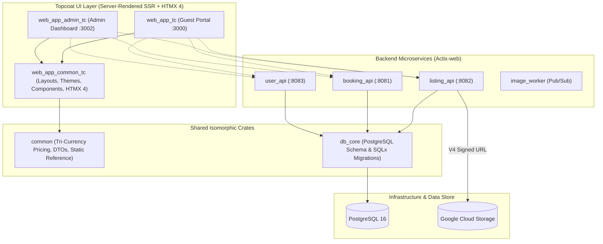

# Spec 80: Create Topcoat UI Projects & Feature Parity Architecture

## Overview

The **Our Places** short-term luxury villa booking platform currently operates using WebAssembly frontend applications built on Leptos (`web_app` for guests, `web_app_admin` for administrators, and `web_app_common` for shared components). 

To optimize cold-start performance, eliminate heavy client-side WebAssembly bundles, and leverage modern server-driven UI paradigms on GCP Cloud Run ($0.25\text{ vCPU}$, $256\text{MB RAM}$), this specification details the architectural migration and implementation of new **Topcoat** UI projects:
- **`web_app_common_tc`**: Shared Topcoat UI library, Tailwind CSS/DaisyUI design tokens, HTMX 4 integration, automated time-of-day theme engine, and backend API clients.
- **`web_app_tc`**: High-performance, server-rendered public guest portal for villa search, booking checkout with 15-minute atomic holds, verified review submission, and guest profile management.
- **`web_app_admin_tc`**: Secure, server-rendered internal administration dashboard for listing management, dynamic seasonal pricing rules, booking audit logs, and user role management.

The implementation is structured into sequential, independently testable phases: Phase 1 (Foundation & Shared UI), Phase 2 (Public Guest Portal), Phase 3 (UI Polish & Leptos Parity Tightening), and Phase 4 (Administrative Dashboard).

---

## 1. Technical Specification & Phased Architecture



---

### Phase 1: Foundation & Shared UI Library (`web_app_common_tc`)

The foundation crate encapsulates shared layouts, HTMX assets, Tailwind/DaisyUI styling, time-of-day theme automation, and HTTP client infrastructure.

#### 1.1. Crate Configuration & Build Pipeline
- **Crate**: `web_app_common_tc` (Rust 2024 edition, target library `rlib`).
- **Dependencies**: `topcoat` (features: `htmx`, `tailwind`, `router`, `view`), `common`, `serde`, `serde_json`, `reqwest`, `tracing`, `chrono`, `anyhow`.
- **Build Script (`build.rs`)**: Uses `topcoat::tailwind::BuildConfig::new().input("src/style/tailwind.css").render()` to execute the standalone Tailwind CLI v4 pipeline.

#### 1.2. Tailwind CSS & DaisyUI Theme Configuration
- **Input Stylesheet (`src/style/tailwind.css`)**:
  - `@import "tailwindcss";`
  - `@plugin "daisyui";`
  - `@plugin "daisyui/theme" { name: "emerald"; default: true; color-scheme: "light"; }`
  - `@plugin "daisyui/theme" { name: "sunset"; default: false; color-scheme: "dark"; }`
  - `@custom-variant dark (&:where(.dark, .dark *));`
- **Tailwind Config (`tailwind.config.js`)**:
  - `darkMode: 'class'` (enforces class-based theme selector rather than OS `prefers-color-scheme`).
  - Scanned content: `./src/**/*.{rs,html}`, `../web_app_tc/src/**/*.{rs,html}`, `../web_app_admin_tc/src/**/*.{rs,html}`.

#### 1.3. Time-of-Day Automated Theme Engine & Manual Switcher (`src/theme.rs`)
- **Automated Default Selection**:
  - If no manual theme preference is stored in `localStorage`, the client time of day is evaluated.
  - If current local hour $\ge 18$ (6:00 PM) or $< 6$ (6:00 AM), the dark theme (`sunset`) and `.dark` class are applied.
  - Otherwise, the light theme (`emerald`) is applied.
- **FOUC Prevention**: Inline synchronous JavaScript executed in `<head>` before browser DOM rendering:
  ```javascript
  (function() {
      try {
          var stored = localStorage.getItem('theme');
          var theme = stored;
          if (!theme) {
              var hour = new Date().getHours();
              theme = (hour >= 18 || hour < 6) ? 'sunset' : 'emerald';
          }
          document.documentElement.setAttribute('data-theme', theme);
          if (theme === 'sunset') {
              document.documentElement.classList.add('dark');
          } else {
              document.documentElement.classList.remove('dark');
          }
      } catch (e) {
          document.documentElement.setAttribute('data-theme', 'emerald');
      }
  })();
  ```
- **Interactive Component (`theme_toggle`)**:
  - DaisyUI button visible on all pages in the top navigation bar.
  - Toggles `data-theme` between `emerald` and `sunset`, toggles the `.dark` class on `<html>`, and writes the choice to `localStorage.setItem('theme', ...)`.

#### 1.4. HTMX 4 Integration & Base Layout (`src/layout.rs`)
- **Vendored Script**: Self-hosted `htmx.4.0.0.min.js` placed in `src/assets/htmx.min.js` and bundled content-hashed via Topcoat asset pipeline.
- **HTMX Fragment Routing**:
  - Topcoat router layout inspects `hx_request(cx)`.
  - Full browser navigation: renders complete HTML document shell (`<!DOCTYPE html>`, `<head>`, scripts, header, footer, `(slot?)`).
  - HTMX AJAX request: bypasses document shell and returns only the rendered inner component fragment `(slot?)`.

#### 1.5. Shared UI Components
- **`VillaCard`**: Visual property card featuring image carousel/thumbnail, title, location (parish, Jamaica), base/converted nightly rate, overall rating, and review count badge.
- **`ResponsiveImage`**: Generates HTML `<picture>` and `srcset` tags for 640px (mobile), 1024px (tablet), and 1920px (desktop) WebP assets hosted on GCS.
- **`StarRating`**: Renders SVG star icons (with fractional support) and review count link.
- **`PriceBreakdown`**: Itemized stay summary calculating nights, effective daily rate, statutory GCT 15% (`common::reference::JAMAICAN_GCT_RATE`), and tri-currency conversions (`rust_decimal::Decimal`).

#### 1.6. Shared Backend HTTP Client (`src/api_client.rs`)
- Re-exports `common::app_client::get_client()` with automatic Google Cloud Run IAM OIDC authentication token generation for zero-trust microservice communication.

---

### Phase 2: Public Guest Portal (`web_app_tc`)

The guest application provides full feature parity with the Leptos `web_app`, running on port `3000`.

#### 2.1. Routing Map & Page Structure
| Route | Method | Layout | Description |
| :--- | :--- | :--- | :--- |
| `/` | `GET` | `base_layout` | Landing hero, featured villas, search filter bar. |
| `/listings` | `GET` | `base_layout` | Search results grid with HTMX live filtering (dates, guests, parish). |
| `/listings/{id}` | `GET` | `base_layout` | Villa detail view, amenities, reviews, interactive booking widget. |
| `/checkout/{id}` | `GET`, `POST` | `base_layout` | 15-minute hold checkout flow, guest details, payment quote. |
| `/login` | `GET`, `POST` | `base_layout` | Guest login (password or 6-digit email code). |
| `/register` | `GET`, `POST` | `base_layout` | Account registration with shadow user promotion. |
| `/verify` | `GET`, `POST` | `base_layout` | 6-digit email verification code input. |
| `/bookings` | `GET` | `base_layout` | Guest reservation dashboard (upcoming, active, past). |
| `/bookings/{id}` | `GET` | `base_layout` | Itemized booking details, receipt, and cancellation modal. |
| `/reviews/submit` | `GET`, `POST` | `base_layout` | Verified guest review submission gated by 15-day token. |
| `/profile` | `GET`, `POST` | `base_layout` | User profile management, password update, currency preferences. |
| `/about` | `GET` | `base_layout` | About Our Places and Jamaican villa portfolio story. |

#### 2.2. Interactive HTMX 4 Workflows
1. **Dynamic Search & Filtering (`/listings`)**:
   - Filter form triggers `hx-get="/listings/filter"` on `input` or `change` event with `hx-target="#listings-grid"` and `hx-push-url="true"`.
   - Server returns filtered `<div id="listings-grid">` partial containing matching `VillaCard` items without full-page reload.
2. **Dynamic Stay Pricing Quote (`/listings/{id}`)**:
   - Date range selector triggers `hx-post="/listings/{id}/quote"` on date selection.
   - Evaluates `common::pricing::calculate_dynamic_quote` against seasonal price overrides.
   - Updates the booking sidebar with itemized nightly rates, statutory GCT 15%, and converted currency total.
3. **Atomic Booking Hold & Timer (`/checkout/{id}`)**:
   - Initiates `POST /bookings/hold` against `booking_api`.
   - Creates a `pending_payment` reservation hold with 15-minute `expires_at`.
   - Renders a client-side countdown timer in the checkout header.
   - If timer reaches zero before payment, HTMX swaps the form for an expiration alert with a re-hold button.
4. **Verified Review Submission (`/reviews/submit?token=...`)**:
   - Validates the token's 15-day eligibility window post-stay.
   - On submission (`hx-post="/reviews/submit"`), invokes `listing_api` with row-level atomic rating aggregation.

---

### Phase 3: UI Polish & Leptos Parity Tightening (`web_app_tc` & `web_app_common_tc`)

This phase focuses on tightening the user interface, component fidelity, and visual polish of `web_app_tc` and `web_app_common_tc` to strictly match the design, interactivity, and layout of the original Leptos `web_app` project (while preserving the Topcoat theme configuration `emerald` light / `sunset` dark).

#### 3.1. Header & Navigation Parity (`web_app_common_tc/src/layout.rs`)
- **Interactive Profile Avatar & Dropdown**:
  - Implement full DaisyUI dropdown (`dropdown dropdown-end`) with avatar image (`https://ui-avatars.com/api/?name=...&background=random` or initials placeholder).
  - Header in dropdown displaying authenticated user's full name and email with truncation.
  - Menu items: `Profile` (`/profile`), `My Bookings` (`/bookings`), `Settings` (`/profile`), and `Logout` button.
  - Unauthenticated fallback: `Log In` button (`/login`) and `Sign Up` button (`/register`).
- **Navbar Search Bar**:
  - Add search places input (`input w-24 md:w-64`) in the top navigation bar matching Leptos navbar layout.
- **Responsive Mobile Drawer**:
  - Implement DaisyUI drawer toggle (`drawer`, `my-drawer-2`, `drawer-content`) with hamburger button on mobile screens.
- **Header Controls Integration**:
  - Seamless layout containing `currency_selector`, `theme_toggle`, search bar, navigation links (`Home`, `Listings`, `About`), and user profile avatar dropdown.

#### 3.2. Page UI & Visual Polish
1. **Hero & Landing Page (`web_app_tc/src/pages/home.rs`)**:
   - Full viewport hero section (`hero min-h-screen` or `hero min-h-[75vh]`) with backdrop overlay, luxury headline, subheadline, and direct booking CTA.
   - Featured villa grid layout, spacing, typography, and card transitions matching Leptos `home.rs`.
2. **Listings Search Page (`web_app_tc/src/pages/listings.rs`)**:
   - Match Leptos search layout: `join` search bar with text input, property type filter dropdown (`select join-item`), and primary search trigger button.
   - Two-column responsive card grid (`grid grid-cols-1 lg:grid-cols-2 gap-6 w-full max-w-5xl`).
3. **Listing Details (`web_app_tc/src/pages/listing_detail.rs`)**:
   - DaisyUI multi-image carousel with slide indicators and prev/next controls (`carousel`, `carousel-item`, prev/next circle buttons).
   - Host summary banner, amenities grid, verified reviews, and sticky booking card with dynamic price calculation.
4. **Checkout & Auth Flows (`checkout.rs`, `auth.rs`, `review.rs`)**:
   - Clean card containers, social login buttons (Google/Facebook), tabbed login methods (Traditional vs. Passwordless TOTP), and 6-digit verification code input.
   - Star rating inputs with DaisyUI mask classes (`mask mask-star`).

---

### Phase 4: Administrative Dashboard (`web_app_admin_tc`)

The admin application provides full feature parity with the Leptos `web_app_admin`, running on port `3002`.

#### 3.1. Routing Map & Page Structure
| Route | Method | Layout | Description |
| :--- | :--- | :--- | :--- |
| `/login` | `GET`, `POST` | `base_layout` | Admin/Host authentication and session initialization. |
| `/` | `GET` | `base_layout` | Administrative KPI dashboard (listings, revenue, system telemetry). |
| `/admin/listings` | `GET` | `base_layout` | Listing management table with search and ownership filters. |
| `/admin/listings/new` | `GET`, `POST` | `base_layout` | Villa creation wizard with Nominatim geocoding & direct GCS uploads. |
| `/admin/listings/{id}/edit` | `GET`, `POST` | `base_layout` | Villa edit form, photo management, and amenity toggles. |
| `/admin/listings/{id}/pricing` | `GET`, `POST` | `base_layout` | Seasonal dynamic price overrides & minimum night stay configuration. |
| `/admin/bookings` | `GET` | `base_layout` | Master booking schedule, hold status, and date lock monitor. |
| `/admin/users` | `GET` | `base_layout` | User directory, role assignment (`admin`, `host`, `booker`), shadow audits. |
| `/admin/exchange-rates` | `GET`, `POST` | `base_layout` | Live currency exchange rates sync and manual override panel. |

#### 3.2. Administrative HTMX 4 Workflows
1. **Dynamic Seasonal Price Overrides (`/admin/listings/{id}/pricing`)**:
   - Form for adding/editing date overrides (`start_date`, `end_date`, `nightly_rate`, `min_nights`).
   - `hx-post="/admin/listings/{id}/pricing"` validates non-overlapping intervals via `listing_api` and swaps the updated override table fragment into `#price-overrides-table`.
2. **Direct-to-GCS Photo Management**:
   - Topcoat admin requests V4 Signed Upload URL from `listing_api` (`POST /listings/{id}/images/signed-url`).
   - Client JS uploads image directly to Google Cloud Storage (bypassing backend servers).
   - Once upload completes, HTMX sends `POST /admin/listings/{id}/images/register` to record the GCS URI and trigger the `image_worker` Pub/Sub resizing pipeline.
3. **Telemetry & Live Telemetry Stream (`/admin/htmx/stats`)**:
   - Admin KPI metrics refresh on-demand or via HTMX polling (`hx-trigger="every 30s"`).

---

## 2. Performance & Scalability Considerations

1. **Cloud Run Scale-to-Zero Latency Budget**:
   - **Cold Start**: Target $< 300\text{ms}$ (p50) and $< 1.0\text{s}$ (p95) on Cloud Run $0.25\text{ vCPU}$, $256\text{MB RAM}$.
   - **Binary Size Optimization**: Topcoat server-rendered binaries compiled with release profile `opt-level = "z"`, `lto = true`, and `codegen-units = 1`.
   - **Zero Client WASM Overhead**: Unlike Leptos (which downloads a 2–5MB WASM bundle before interactivity), Topcoat serves raw HTML with lightweight HTMX 4 (~36KB), achieving sub-100ms First Contentful Paint (FCP) and Largest Contentful Paint (LCP).
2. **Big-O Efficiency & Database Query Safeguards**:
   - **No N+1 Query Loops**: Listing queries join property amenities, photos, and price overrides in single indexed SQL statements.
   - **Pagination**: All listings, bookings, and user tables use keyset or bounded offset/limit pagination ($O(1)$ / $O(\log N)$ index scans).
3. **Async Runtime Non-Blocking Guardrail**:
   - All I/O is purely asynchronous with Tokio and Actix HTTP clients. CPU-intensive operations (such as bcrypt password hashing) must strictly run via `tokio::task::spawn_blocking`.
4. **Bandwidth Preservation**:
   - Raw image streaming through Topcoat or Actix endpoints is strictly prohibited. Image uploads use direct GCP V4 Signed URLs to GCS.

---

## 3. Threat Modeling & Security Review (OWASP Top 10)

| Threat Category | Potential Attack Vector | Topcoat & Architecture Mitigation |
| :--- | :--- | :--- |
| **Injection (SQL / Command)** | Malicious SQL inputs in search filters or dynamic parameters. | Compile-time verified parameterized queries via `sqlx::query!`. Dynamic user inputs are never concatenated into raw SQL strings. |
| **Cross-Site Scripting (XSS)** | Injection of malicious scripts in review comments or listing descriptions. | Topcoat's `view!` macro automatically HTML-escapes all dynamic string variables `(name)`. Raw unescaped HTML injections are prevented at compile-time. |
| **Cross-Site Request Forgery (CSRF)** | Unauthorized HTMX POST/PUT actions from third-party sites. | SameSite HTTP-only cookies and strict `Origin` / `Referer` validation enforced via Topcoat router origin layers. |
| **Broken Access Control** | Host editing another host's listing or viewing unowned bookings. | Route handlers validate user JWT claims (`sub`, `roles`). `listing_api` enforces that `listing.host_id == claims.sub` before mutation. |
| **Concurrency Double-Booking** | Two guests simultaneously submitting checkout for the same villa dates. | PostgreSQL serializable transaction with row-level locks (`SELECT * FROM listing WHERE id = $1 FOR UPDATE`) and exclusion constraints. |
| **Shadow User Hijacking** | Malicious actor claiming a guest's pending reservation hold. | Booking holds are tied to cryptographically secure UUIDv7 IDs. Promotion requires verifying the user's email via a 6-digit code. |
| **Sensitive Data Exposure** | Plaintext credentials or internal stack traces leaked to clients. | Passwords hashed with `bcrypt` (work factor 12). Error responses use unified `AppError` payloads stripping internal database errors before returning to clients. |

---

## 4. Comprehensive Test Plan

### 4.1. Unit Testing
- **Tri-Currency Mathematics (`common/src/pricing.rs`)**:
  - Test base price conversion to payment currency without floating-point drift (`rust_decimal::Decimal`).
  - Test static Jamaican GCT 15% computation.
  - Test seasonal dynamic rate override application across partial and full stay date intervals.
- **Theme Script Logic (`web_app_common_tc/src/theme.rs`)**:
  - Verify 6:00 PM time-of-day rule defaults to `sunset` (dark) when `localStorage` is empty.
  - Verify stored user preference overrides time-of-day condition.
- **HTMX Header Parsing (`web_app_common_tc/src/layout.rs`)**:
  - Verify `hx_request(cx)` returns `true` when `HX-Request: "true"` header is present and bypasses document shell.

### 4.2. Integration Testing
- **Backend API Integration (`web_app_common_tc/src/api_client.rs`)**:
  - Verify HTTP communication with `listing_api`, `booking_api`, and `user_api` test containers.
  - Test response deserialization into shared `common::models` DTOs.
- **Topcoat Router & Page Discovery (`web_app_tc` & `web_app_admin_tc`)**:
  - Test `GET /` returns HTTP 200 with `<html data-theme="emerald">`, Tailwind stylesheet, and HTMX script.
  - Test `GET /htmx/welcome` with `HX-Request: "true"` returns bare `<div class="alert alert-success">` fragment without outer layout wrapper.
  - Test `GET /admin/htmx/stats` returns refreshed timestamp telemetry fragment.

### 4.3. End-to-End (E2E) Verification Scenarios
1. **Theme Switcher & Persistence**:
   - Open `http://127.0.0.1:3000`.
   - Click theme toggle button $\rightarrow$ verify `data-theme="sunset"` and `class="dark"` applied to `<html>`.
   - Refresh page $\rightarrow$ verify `sunset` theme persists from `localStorage`.
2. **HTMX Dynamic Fragment Swap**:
   - Click **"Explore Stays (HTMX)"** on `/` $\rightarrow$ verify network request is made via HTMX and `#htmx-demo` is updated in-place without page reload.
3. **15-Minute Hold Concurrency Test**:
   - Two concurrent sessions initiate hold on Villa A for overlapping dates $\rightarrow$ Session 1 receives HTTP 201 Created with 15-minute countdown; Session 2 receives HTTP 409 Conflict `"DATE_UNAVAILABLE"`.
4. **Verified Review Life-Cycle**:
   - Guest with completed stay accesses `/reviews/submit?token=<valid_token>` $\rightarrow$ submits 5-star review $\rightarrow$ verify review is recorded, token is invalidated (`used_at = NOW()`), and listing average rating is atomically updated.
