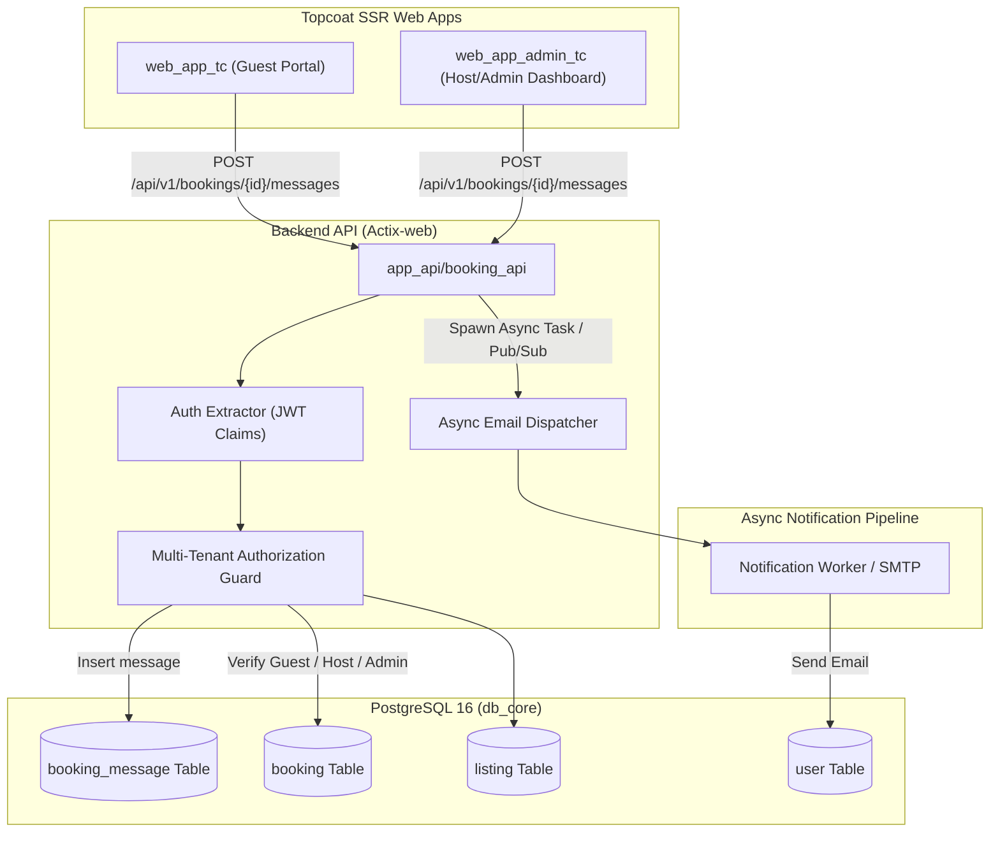

# Spec 81: Guest-Host Messaging System Linked to Bookings

## Overview

Effective communication between guests and property hosts is critical for smooth hospitality operations, check-in logistics, house rules clarification, and emergency handling. Prior to this feature, guests and hosts had no centralized in-platform messaging hub, forcing communications into off-platform channels (SMS, WhatsApp, external email) where context is lost and disputes cannot be audited.

This specification details the end-to-end design and technical implementation of the **Guest-Host Messaging System** for the Our Places platform. Under this system:
1. Every message thread is anchored directly to a reservation (`booking_id`).
2. Communication is supported across `BookingStatus::Pending` (awaiting host/admin approval), `BookingStatus::Confirmed`, and `BookingStatus::Completed` reservation stages.
3. Access is strictly authorized: only the reservation's guest, the villa's assigned host (`listing.user_id`), or a platform admin can read or append messages.
4. Messages are immutable audit records with sender attribution (`guest`, `host`, `admin`), message text (capped at 2,000 characters), and read receipts (`read_at`).
5. Messages authored by platform administrators are clearly labeled and rendered as `[Name] (admin)` (e.g. `John (admin)`).
6. Sending a message fires an asynchronous notification event to dispatch email notifications to the recipient counterpart.
7. Frontend user interfaces are delivered using **Topcoat SSR** and **HTMX** (`web_app_tc`, `web_app_admin_tc`, and `web_app_common_tc`).

---

## Requirements & Scope Boundaries

### In Scope
- **Database (`db_core`)**:
  - New table `booking_message` linked to `booking(id)` and `user(id)` with sender role tracking (`guest`, `host`, `admin`), `content` text, `read_at TIMESTAMPTZ`, and `created_at TIMESTAMPTZ`.
  - Composite indexes for fast chronological retrieval `(booking_id, created_at ASC)` and unread counting `(booking_id, recipient_id, read_at)`.
- **Shared DTOs & Validation (`common`)**:
  - DTOs for message payloads, lists, and unread counters.
  - Validation: Non-empty trimmed text, max 2,000 characters, control character rejection.
- **Backend API (`app_api/booking_api`)**:
  - `GET /api/v1/bookings/{id}/messages`: Fetch chronological message thread and unread count.
  - `POST /api/v1/bookings/{id}/messages`: Append message to thread with strict authorization check.
  - `PATCH /api/v1/bookings/{id}/messages/read`: Mark counterpart messages as read (`read_at = NOW()`).
  - Async event dispatch: Emit background notification event to email the counterpart.
- **Shared HTTP Client (`web_app_common_tc`)**:
  - Reusable API client functions for fetching, sending, and marking messages as read.
- **Guest Portal UI (`web_app_tc`)**:
  - Dedicated messaging page (`/bookings/{confirmation_code}/messages` in `booking_messages.rs`).
  - Booking list card button (`💬 Message Host`) with unread count badge linking to the dedicated messaging page.
  - HTMX-powered real-time message submission with graceful error handling and auto-scroll.
  - Safe guards for cancelled reservations with disabled composer and alert status.
- **Admin Dashboard UI (`web_app_admin_tc`)**:
  - Dedicated admin messaging page (`/admin/bookings/{confirmation_code}/messages` in `booking_messages_admin.rs`).
  - Booking management table action linking to dedicated conversation page.
  - Clear `[Name] (admin)` attribution for admin replies, unread message badges, and HTMX chat composer.

### Out of Scope
- Full-duplex persistent WebSockets or Server-Sent Events (SSE); polling / HTMX interval refresh is used.
- File or image attachments (MVP supports plain text up to 2,000 characters).
- Arbitrary user-to-user messaging disconnected from a booking record.

---

## 1. Technical Specification

### 1.1. System Architecture Flow



---

### 1.2. Database Schema & Migrations (`db_core`)

#### New Migration: `db_core/migrations/20260909000000_create_booking_message_table.sql`

```sql
-- Create ENUM for sender role
CREATE TYPE message_sender_role AS ENUM ('guest', 'host', 'admin');

-- Create booking_message table
CREATE TABLE booking_message (
    id UUID PRIMARY KEY DEFAULT uuidv7(),
    booking_id UUID NOT NULL REFERENCES booking(id) ON DELETE CASCADE,
    sender_id UUID NOT NULL REFERENCES "user"(id) ON DELETE RESTRICT,
    sender_role message_sender_role NOT NULL,
    sender_name VARCHAR(120) NOT NULL,
    message_text VARCHAR(2000) NOT NULL,
    read_at TIMESTAMPTZ,
    created_at TIMESTAMPTZ NOT NULL DEFAULT NOW()
);

-- Index for chronological thread retrieval
CREATE INDEX idx_booking_message_thread 
ON booking_message (booking_id, created_at ASC);

-- Index for unread query filtering
CREATE INDEX idx_booking_message_unread 
ON booking_message (booking_id, sender_role, read_at) 
WHERE read_at IS NULL;
```

#### Database Entities & Repository Queries (`db_core/src/booking_message.rs`)

```rust
pub struct DbBookingMessage {
    pub id: Uuid,
    pub booking_id: Uuid,
    pub sender_id: Uuid,
    pub sender_role: String,
    pub sender_name: String,
    pub message_text: String,
    pub read_at: Option<DateTime<Utc>>,
    pub created_at: DateTime<Utc>,
}

pub async fn list_booking_messages(
    pool: &PgPool,
    booking_id: Uuid,
) -> Result<Vec<DbBookingMessage>, DbError>;

pub async fn insert_booking_message(
    pool: &PgPool,
    booking_id: Uuid,
    sender_id: Uuid,
    sender_role: &str,
    sender_name: &str,
    message_text: &str,
) -> Result<DbBookingMessage, DbError>;

pub async fn mark_booking_messages_as_read(
    pool: &PgPool,
    booking_id: Uuid,
    reader_role: &str,
) -> Result<u64, DbError>;

pub async fn get_booking_parties(
    pool: &PgPool,
    booking_id: Uuid,
) -> Result<BookingParties, DbError>;
```

---

### 1.3. Shared Models & DTOs (`common/src/models.rs`)

```rust
#[derive(Debug, Clone, Copy, PartialEq, Eq, Serialize, Deserialize, ToSchema)]
#[serde(rename_all = "snake_case")]
pub enum MessageSenderRole {
    Guest,
    Host,
    Admin,
}

#[derive(Debug, Clone, Serialize, Deserialize, Validate, ToSchema)]
pub struct CreateBookingMessageRequest {
    #[validate(length(min = 1, max = 2000, message = "Message must be between 1 and 2,000 characters"))]
    pub message_text: String,
}

#[derive(Debug, Clone, Serialize, Deserialize, ToSchema)]
pub struct BookingMessageResponse {
    pub id: Uuid,
    pub booking_id: Uuid,
    pub sender_id: Uuid,
    pub sender_role: MessageSenderRole,
    pub sender_name: String,
    pub display_name: String, // Explicitly formatted as "John (admin)" if Admin
    pub message_text: String,
    pub is_read: bool,
    pub read_at: Option<DateTime<Utc>>,
    pub created_at: DateTime<Utc>,
}

#[derive(Debug, Clone, Serialize, Deserialize, ToSchema)]
pub struct BookingMessagesWrapper {
    pub messages: Vec<BookingMessageResponse>,
    pub unread_count: usize,
}

#[derive(Debug, Clone, Serialize, Deserialize, ToSchema)]
pub struct MarkMessagesReadResponse {
    pub updated_count: u64,
}
```

---

### 1.4. Booking API Routes & Handlers (`app_api/booking_api`)

#### Endpoints

| Method | Path | Auth Required | Description |
| :--- | :--- | :--- | :--- |
| `GET` | `/api/v1/bookings/{id}/messages` | JWT (Bearer) | List all messages for a booking and unread count. |
| `POST` | `/api/v1/bookings/{id}/messages` | JWT (Bearer) | Post a new message to the booking thread. |
| `PATCH` | `/api/v1/bookings/{id}/messages/read` | JWT (Bearer) | Mark counterpart messages as read (`read_at = NOW()`). |

#### Authorization & Admin Attribution Logic

```rust
// Verify caller belongs to booking party
let parties = db_booking::get_booking_parties(&pool, booking_id).await?;

// Determine caller's role
let caller_role = if claims.roles.contains(&"admin".to_string()) {
    MessageSenderRole::Admin
} else if claims.sub == parties.guest_id {
    MessageSenderRole::Guest
} else if claims.sub == parties.host_id {
    MessageSenderRole::Host
} else {
    return Err(ApiError::Forbidden("You do not have permission to access messages for this booking".into()));
};

// Admin attribution formatting:
let display_name = match caller_role {
    MessageSenderRole::Admin => format!("{} (admin)", claims.name),
    _ => claims.name.clone(),
};
```

---

### 1.5. Async Email Notification Flow

1. Upon successful database insertion of a message:
   - Identify the recipient(s):
     - If sender is **Guest** $\rightarrow$ Recipient is **Host** (`listing.user_id`).
     - If sender is **Host** $\rightarrow$ Recipient is **Guest** (`booking.guest_id`).
     - If sender is **Admin** $\rightarrow$ Recipients can be both **Guest** and **Host**.
2. Non-blocking dispatch:
   - Spawned asynchronously via `tokio::spawn` or background event channel.
   - Emits structured event payload containing:
     - `booking_id`, `confirmation_code`
     - `recipient_email`, `recipient_name`
     - `sender_display_name`
     - `message_snippet` (first 100 characters)
     - `booking_url` (direct deep link to `/bookings` or `/admin/bookings`)
   - HTTP response returns immediately to client with $< 50\text{ms}$ latency.

---

### 1.6. Topcoat SSR Frontends

#### 1.6.1. Dedicated Messaging Architecture
Rather than confining conversation threads to tight modals or collapsible accordion rows on the main bookings list, the platform provides **dedicated, full-featured messaging pages** for both guest and host/admin contexts. This design maximizes readability, simplifies navigation, ensures clean mobile responsiveness, and guarantees deep-linkability.

#### 1.6.2. Guest Dedicated Messaging Page (`web_app_tc`)
- **Route & Handler**:
  - `GET /bookings/{confirmation_code}/messages` rendered by `booking_messages_page` in `web_app_tc/src/pages/booking_messages.rs`.
  - `POST /bookings/{confirmation_code}/messages` handled by `send_booking_message_htmx`.
- **Page Layout & Key Components**:
  - **Header & Breadcrumbs**:
    - `← Back to Bookings` navigation button to quickly return to the reservations list.
    - Page Title: `"Message [Host Name]"` (e.g. `Message Johnathan`).
    - **Property Link & Details**: Prominently displays the listing name with an active link to the listing details page (`/listings/{slug}`) and an explicit `"View Listing ↗"` button.
    - Reservation Metadata: Displays dates (`Stay from [Check-in] to [Check-out]`), total price & payment currency (e.g. `USD 1,250.00`), and formatted booking status badge (`Confirmed`, `Pending`, or `Cancelled`).
  - **Conversation Details Bar**:
    - Shows reservation confirmation code (`Booking ID: #OP-84920`).
  - **Chronological Message History Container (`#messages-list`)**:
    - **Guest Alignment**: Messages sent by the current guest are right-aligned (`chat chat-end`, `chat-bubble-primary`). Messages sent by the host or admin are left-aligned (`chat chat-start`, `chat-bubble-secondary`).
    - **Attribution & Timestamps**: Each bubble displays the sender's name and formatted timestamp (`%b %d, %H:%M`, e.g., `Sep 10, 14:32`).
    - **Auto-Read Receipt**: Automatically calls `PATCH /api/v1/bookings/{id}/messages/read` when the page loads, clearing unread indicators.
    - **Empty State**: Displays an inviting welcome state (`"No messages yet. Say hello to [Host Name]!"`) if no messages exist.
  - **Interactive HTMX Message Composer**:
    - Accessible input field with placeholder `"Type your message here..."` and a `"Send"` button.
    - Uses `hx-post="/bookings/{confirmation_code}/messages"`, `hx-target="#messages-list"`, and `hx-swap="beforeend"`.
    - Automatically resets the input field on submit and scrolls `#messages-list` to the bottom.
    - **Graceful Error Handling**: Non-2xx API responses (such as validation failures) return an inline alert rather than a 500 error.
  - **Cancelled Reservation Safeguard**:
    - If `booking.status` is `cancelled` or `refunded`, the composer form is disabled and replaced with:
      > *"⚠️ This booking is cancelled. Messaging is no longer available."*

#### 1.6.3. Host / Admin Dedicated Messaging Page (`web_app_admin_tc`)
- **Route & Handler**:
  - `GET /admin/bookings/{confirmation_code}/messages` rendered by `booking_messages_admin_page` in `web_app_admin_tc/src/pages/booking_messages_admin.rs`.
  - `POST /admin/bookings/{confirmation_code}/messages` handled by `send_booking_message_admin_htmx`.
- **Page Layout & Key Components**:
  - **Header & Navigation**:
    - `← Back to Bookings` navigation button returning to `/admin/bookings`.
    - Page Title: `"Message [Guest Name]"`.
    - **Property Link & Details**: Displays listing name with a link to the admin listing page (`/admin/listings/{slug}`) and `"View Listing ↗"` action button.
    - Summary banner showing stay dates, total revenue, and status.
  - **Conversation Details Bar**:
    - Displays confirmation code and guest reference.
  - **Chronological Message History Container (`#admin-messages-list`)**:
    - **Host/Admin Alignment**: Messages sent by Hosts or Platform Admins are right-aligned (`chat chat-end`, `chat-bubble-primary`). Messages from the Guest are left-aligned (`chat chat-start`, `chat-bubble-secondary`).
    - **Admin Attribution**: Platform administrator messages display formatted names: `[First Name] (admin)`.
  - **Interactive HTMX Message Composer**:
    - Form posting to `/admin/bookings/{confirmation_code}/messages` with `hx-swap="beforeend"` targeting `#admin-messages-list`.
    - Same cancelled booking guard disabling new inputs on cancelled reservations.

#### 1.6.4. Bookings List Navigation Integration
- In `web_app_tc/src/pages/bookings.rs`: Each booking card includes a direct action button:
  - `"💬 Message Host"` linking to `/bookings/{confirmation_code}/messages`.
  - Displays a red badge with the unread count when `unread_count > 0`.
- In `web_app_admin_tc/src/pages/bookings_admin.rs`: Booking entries display an unread indicator and a direct link to `/admin/bookings/{confirmation_code}/messages`.

---

## 2. Performance Considerations

### 2.1. Big-O Complexity Analysis
- **Message List Retrieval**: $\mathcal{O}(M)$ where $M$ is the number of messages in the thread. Enforced by index `idx_booking_message_thread (booking_id, created_at ASC)`. For typical short-term reservations ($M < 100$), index range scan latency is $< 5\text{ms}$.
- **Unread Counting**: $\mathcal{O}(K)$ where $K$ is the unread message count, supported by partial index `idx_booking_message_unread WHERE read_at IS NULL`.
- **Insert Message**: $\mathcal{O}(1)$ single-row insertion.

### 2.2. N+1 Query Elimination
- Sender display information (`sender_name`, `sender_role`) is denormalized directly into `booking_message` at insertion time from validated session claims.
- Message list query requires **zero** joins to the `user` table to render, completely eliminating N+1 database roundtrips.

### 2.3. Scale-to-Zero Cloud Run Budgets
- In accordance with `ARCHITECTURE.md` ($0.25\text{ vCPU}$, $256\text{MB RAM}$ limits):
  - No background persistent WebSocket connection pools or in-memory state stores.
  - Database connection pool utilizes lightweight shared `PgPool` references.
  - Memory consumption per request remains $< 100\text{KB}$.
  - Async email emission uses lightweight Tokio tasks with timeout guards (5s max) to prevent stalled threads.

---

## 3. Threat Modeling & Security Mitigations

### 3.1. OWASP Top 10 & Threat Matrix

| Threat Category | Attack Vector | Severity | Mitigation Strategy |
| :--- | :--- | :--- | :--- |
| **Broken Access Control (BOLA / IDOR)** | Malicious user supplies arbitrary `booking_id` to read or post messages. | **Critical** | Multi-tenant authorization guard validates that `claims.sub == guest_id` OR `claims.sub == host_id` OR `claims.roles.contains("admin")`. All unauthorized attempts return `403 Forbidden`. |
| **Impersonation / Role Spoofing** | Caller submits forged `sender_role` or `sender_name` in request body. | **High** | Request body contains only `message_text`. `sender_id`, `sender_role`, and `sender_name` are extracted exclusively from server-verified JWT claims. |
| **Cross-Site Scripting (XSS)** | Attacker inputs `<script>` or HTML payload in `message_text`. | **High** | 1. Input sanitization rejects null bytes (`\0`) and invalid control chars.<br>2. Topcoat SSR view templates automatically HTML-entity escape all interpolated variables (`&lt;`, `&gt;`, `&quot;`, `&#x27;`). |
| **SQL Injection** | SQL injection vectors in query strings or parameters. | **Critical** | Zero raw SQL formatting. All database queries use compile-time verified `sqlx::query!` and `sqlx::query_as!` macros with parameterized placeholders. |
| **Denial of Service (Payload Flooding)** | Giant text bodies or spamming threads. | **Medium** | Strict character length validation (`1..=2000` chars), `413 Payload Too Large` for oversized requests, and whitespace trimming. |
| **URL Parameter Tampering** | Malformed characters in URL route parameters. | **Medium** | Route IDs verified as valid RFC 4122 / UUIDv7 strings via `Uuid::parse_str`. Invalid formats reject immediately with `400 Bad Request`. |

---

## 4. Test Plan

### 4.1. Unit Tests (`common` & `db_core`)
- [ ] `test_validate_message_length_within_limits`: Verify valid message text (1 to 2,000 characters) passes validation.
- [ ] `test_validate_message_empty_or_whitespace`: Verify empty string and whitespace-only strings fail validation with descriptive errors.
- [ ] `test_validate_message_exceeds_max_length`: Verify string with 2,001 characters fails validation.
- [ ] `test_sanitize_control_characters`: Verify null bytes and control characters are detected and rejected.
- [ ] `test_admin_display_name_formatting`: Verify role `Admin` formats name as `"[Name] (admin)"` while `Guest` and `Host` preserve original name.

### 4.2. Database Integration Tests (`db_core/src/booking_message.rs`)
- [ ] `test_create_booking_message_lifecycle`: Insert guest message and host response, verify retrieval in exact chronological order.
- [ ] `test_mark_messages_as_read`: Insert 3 unread messages; trigger `mark_booking_messages_as_read` for recipient; verify `read_at` is populated and unread count returns 0.
- [ ] `test_booking_message_cascade_delete`: Delete parent booking and verify associated messages cascade cleanly without foreign key violations.

### 4.3. API Integration & Authorization Tests (`app_api/booking_api/src/apis_test.rs`)
- [ ] `test_get_messages_as_authorized_guest`: 200 OK returning thread.
- [ ] `test_get_messages_as_authorized_host`: 200 OK returning thread.
- [ ] `test_get_messages_as_platform_admin`: 200 OK returning thread.
- [ ] `test_get_messages_as_unauthorized_user`: 403 Forbidden when caller is not guest, host, or admin.
- [ ] `test_post_message_on_pending_booking`: 201 Created on `BookingStatus::Pending` reservation.
- [ ] `test_post_message_on_confirmed_booking`: 201 Created on `BookingStatus::Confirmed` reservation.
- [ ] `test_post_message_admin_attribution`: Message returned has `sender_role: "admin"` and `display_name: "Admin User (admin)"`.
- [ ] `test_patch_messages_read_idempotent`: Repeated calls return 200 OK with updated count.

### 4.4. UI Component & E2E Verification
- [ ] Guest portal (`web_app_tc`): Booking card links to dedicated `/bookings/{confirmation_code}/messages` page; conversation thread renders with guest messages right-aligned; HTMX submits and appends message bubble without full page reload; form is disabled on cancelled reservations.
- [ ] Admin dashboard (`web_app_admin_tc`): Booking list displays unread badge and links to `/admin/bookings/{confirmation_code}/messages`; conversation thread renders with host/admin messages right-aligned; admin replies show `[Name] (admin)` attribution; form is disabled on cancelled reservations.

---

## Acceptance Criteria Checklist

- [ ] Database migration `20260909000000_create_booking_message_table.sql` creates `booking_message` table and indexes.
- [ ] Messages can be exchanged on bookings in `BookingStatus::Pending`, `BookingStatus::Confirmed`, and `BookingStatus::Completed`.
- [ ] Messages are disallowed on cancelled bookings, with friendly warnings in the UI preventing form submission.
- [ ] Dedicated messaging pages are available at `/bookings/{confirmation_code}/messages` (guest) and `/admin/bookings/{confirmation_code}/messages` (admin/host).
- [ ] API endpoints for listing messages, sending messages, and marking messages as read are fully implemented and verified via `sqlx::query!`.
- [ ] Multi-tenant authorization strictly rejects unauthorized users with `403 Forbidden`.
- [ ] Admin messages unequivocally display with `[Name] (admin)`.
- [ ] Input validation enforces 1-2,000 characters and strips/rejects malicious control characters.
- [ ] Sending a message dispatches an asynchronous email notification event without blocking HTTP response latency.
- [ ] Topcoat SSR templates in `web_app_tc` and `web_app_admin_tc` render message threads with full XSS escaping.
- [ ] All unit and integration test suites pass (`cargo test --workspace`).
- [ ] Workspace passes `cargo clippy --workspace` and builds cleanly.
